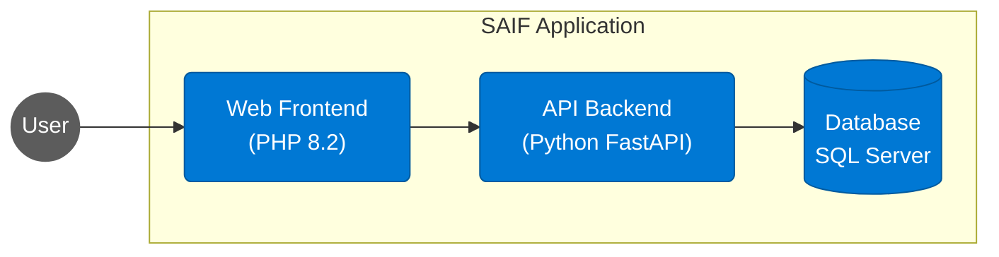

# SAIF: Secure AI Foundations

[](https://github.com/yourusername/SAIF)
[](LICENSE)
[](docs/deployment.md)
[](docs/security-challenges.md)
[](docker-compose.yml)


A 3-tier diagnostic application designed for hands-on learning about securing AI systems across identity, network, application, and content safety domains.

## Project Overview


SAIF is an intentionally insecure application that provides a platform for students to identify security gaps and implement remediation strategies. The application consists of:

1. **Web Frontend**: PHP-based diagnostic interface
2. **API Backend**: Python REST API with various diagnostic endpoints
3. **Database**: SQL Server database for data storage and queries

## Architecture



### Containerized Architecture

The application uses Docker containers for all components:

- **Web Frontend**: PHP 8.2 container
- **API Backend**: Python FastAPI container
- **Database**: SQL Server container (development) / Azure SQL Database (production)

### Azure Deployment Options

When deployed to Azure, the application can use:

- **Web Frontend**: Containerized App Service or Azure Container Apps
- **API Backend**: Containerized App Service or Azure Container Apps
- **Database**: Azure SQL Database

## Deployment

### Local Development

Run SAIF locally using Docker for testing:

```powershell
cd scripts
.\Test-SAIFLocal.ps1
```

### Azure Deployment

SAIF can be deployed to Azure App Service (B1) with a single command:

```powershell
cd scripts
.\Deploy-SAIF.ps1
```

By default, deployment uses Sweden Central region (`swedencentral`) with resource group name `rg-saif-swc01`. For Germany West Central, use:

```powershell
cd scripts
.\Deploy-SAIF.ps1 -location germanywestcentral
```

For a custom deployment:

```powershell
cd scripts
.\Deploy-SAIF.ps1 -resourceGroupName "my-custom-rg" -location "germanywestcentral" -environmentName "saif-prod"
```

For detailed deployment instructions, see the [Deployment Guide](docs/deployment.md).

## Security Challenges

This application contains multiple security vulnerabilities for students to identify and fix, including:

- Identity and Access Management vulnerabilities
- Network security gaps
- Application security issues
- Data protection weaknesses
- API security concerns
- Content safety risks

## Workshop Structure

1. **Deployment**: Deploy the insecure application
2. **Discovery**: Identify security vulnerabilities
3. **Remediation**: Implement fixes for the discovered issues
4. **Verification**: Confirm that the security improvements are effective

## Repository Structure

```mermaid
graph TD
    Root[SAIF Repository] --> API[/api]
    Root --> Web[/web]
    Root --> Infra[/infra]
    Root --> Scripts[/scripts]
    Root --> Docs[/docs]
    Root --> DockerCompose[docker-compose.yml]
    
    API --> APICode[Python FastAPI Code]
    API --> Requirements[requirements.txt]
    
    Web --> WebCode[PHP Frontend]
    Web --> Assets[/assets]
    
    Infra --> BicepTemplates[Bicep Templates]
    Infra --> Modules[/modules]
    
    Scripts --> DeployScript[Deploy-SAIF.ps1]
    Scripts --> TestScript[Test-SAIFLocal.ps1]
    
    Docs --> DeploymentDoc[deployment.md]
    Docs --> SecurityDoc[security-challenges.md]
    
    classDef folder fill:#f9d75e,stroke:#333,color:black;
    classDef file fill:#78b2f2,stroke:#333,color:black;
    classDef component fill:#91ca76,stroke:#333,color:black;
    
    class API,Web,Infra,Scripts,Docs,Modules folder;
    class DockerCompose,Requirements,DeployScript,TestScript,DeploymentDoc,SecurityDoc file;
    class APICode,WebCode,Assets,BicepTemplates component;
```

- `/api`: Python FastAPI backend
- `/web`: PHP web frontend
- `/infra`: Bicep infrastructure templates
  - `/modules`: Modular Bicep components
- `/scripts`: PowerShell deployment and utility scripts
- `/docs`: Documentation and guides
- `docker-compose.yml`: Local development configuration

## Prerequisites

- Azure subscription
- Azure CLI
- PowerShell 7.0+
- Docker and Docker Compose (for local development)
- Visual Studio Code (recommended)

## License

MIT
