# Azure PostgreSQL High Availability Workshop

**Last Updated:** 2025-10-16

> **⚠️ SECURITY NOTICE**: This repository contains intentional security vulnerabilities for training purposes. DO NOT use in production!

[](docs/)
[](https://www.postgresql.org/)
[](https://azure.microsoft.com/en-us/products/postgresql/)
[](LICENSE)

## 🎯 Purpose

Hands-on workshop for learning **Azure PostgreSQL Flexible Server Zone-Redundant High Availability**, failover testing, and database security concepts. Supports two workflows:

1. **SAIF Security Demo** - Vulnerable payment gateway application for security training
2. **High-Performance Load Testing** - 8000+ TPS PostgreSQL HA testing and validation

## 📚 What You'll Learn

- Deploy Zone-Redundant HA PostgreSQL Flexible Server
- Measure RTO (Recovery Time Objective) and RPO (Recovery Point Objective)
- **High-performance load testing** (8000+ TPS validated, 12,000+ TPS capable)
- Test failover scenarios under sustained load
- Identify and fix common security vulnerabilities
- Implement secure database patterns
- Performance monitoring with Azure Workbooks

## 💰 Estimated Costs

**Default Configuration** (as deployed):

| Resource | Configuration | Estimated Cost/Hour | Monthly (730 hrs) |
|----------|--------------|---------------------|-------------------|
| PostgreSQL Flexible Server | Standard_D4ds_v5 (4 vCores, 16 GB RAM) | ~$0.28/hr | ~$205 |
| PostgreSQL Zone-Redundant HA | Standby replica (same SKU) | ~$0.28/hr | ~$205 |
| PostgreSQL Storage | 128 GB Premium SSD | ~$0.05/hr | ~$40 |
| App Service Plan | P1v3 (2 vCPU, 8 GB RAM, Linux) | ~$0.26/hr | ~$190 |
| Container Registry | Standard tier | ~$0.83/day | ~$25 |
| Key Vault | Secrets storage + operations | ~$0.03/day | ~$1 |
| Application Insights | Basic ingestion (Pay-as-you-go) | Variable | ~$10 |
| **Total** | **Zone-Redundant HA Setup** | **~$0.90/hr** | **~$675/month** |

💡 **Workshop duration: 2-4 hours** = **~$3.60 total cost**

**High-Performance Configuration** (for 8K+ TPS testing):

| Resource | Configuration | Estimated Cost/Hour | Monthly (730 hrs) |
|----------|--------------|---------------------|-------------------|
| PostgreSQL Flexible Server | Standard_D16ds_v5 (16 vCores, 64 GB RAM) | ~$1.15/hr | ~$840 |
| PostgreSQL Zone-Redundant HA | Standby replica (same SKU) | ~$1.15/hr | ~$840 |
| PostgreSQL Storage | 8 TB (P60 - 16K IOPS, 500 MB/s) | ~$1.10/hr | ~$800 |
| App Service Plan | P1v3 (2 vCPU, 8 GB RAM, Linux) | ~$0.26/hr | ~$190 |
| Load Testing (ACI) | 16 vCPU, 32 GB RAM (transient) | ~$0.80/hr | **$0** (test only) |
| Supporting services | ACR, Key Vault, Insights | ~$0.04/hr | ~$35 |
| **Total** | **High-Performance Setup** | **~$3.70/hr** | **~$2,705/month** |

💡 **8K TPS Load Test duration: 5-10 minutes** = **~$0.62 test cost**

> 💸 **Cost Optimization Tips**:
> - **Development/Testing**: Use `-disableHighAvailability` flag to reduce costs by ~50% (single-zone deployment)
> - **Stop/Start**: Stop PostgreSQL server when not in use (stops compute costs, only pay for storage)
> - **Reserved Capacity**: Save up to 60% with 3-year reserved pricing for production workloads
> - **Burstable Tier**: Use Standard_B2s (~$0.05/hr) for non-production workloads
> - **Load Testing**: ACI is pay-per-second, delete after test completion to avoid charges

## 🏗️ Architecture

This workshop uses **Azure Database for PostgreSQL Flexible Server** with **Zone-Redundant High Availability** to achieve:

- **RPO = 0** (Zero data loss)
- **RTO = 60-120 seconds** (Automatic failover)
- **SLA = 99.99%** (Zone-redundant deployment)

> 📚 **Documentation**: This README provides a quick overview. For comprehensive documentation, see the [docs/](docs/) directory.

## Architecture

```mermaid
graph TB
  subgraph Azure["☁️ Azure Cloud - Sweden Central"]
    subgraph Zone1["🔵 Availability Zone 1"]
      Web["🌐 Web App Service<br/>(PHP/Apache)<br/>Port 80<br/>(Zonal)"]
      API["⚡ API App Service<br/>(FastAPI)<br/>Port 8000<br/>(Zonal)"]
      PrimaryDB["🗄️ PostgreSQL Primary<br/>Standard_D4ds_v5<br/>Port 5432<br/>128GB Premium SSD"]
      Monitor["📊 Application Insights<br/>& Log Analytics"]
    end
        
    subgraph Zone2["🔷 Availability Zone 2"]
      StandbyDB["🗄️ PostgreSQL Standby<br/>Hot Standby (Read Replica)<br/>Synchronous Replication"]
    end
        
    subgraph Support["🛠️ Supporting Services"]
      KeyVault["🔐 Azure Key Vault<br/>(Secrets & Creds)"]
      ACR["📦 Azure Container Registry<br/>(Docker Images)"]
      Backup["💾 Azure Backup<br/>(7-day retention)"]
    end
        
    LoadGen["🔄 Load Generator<br/>(Optional - ACI)<br/>12,600+ TPS Capacity"]
  end
    
  Users["👥 End Users<br/>(Web Browsers)"]
    
  Users -->|"HTTPS (443)"| Web
  Web -->|"HTTP (8000)"| API
  API -->|"PostgreSQL (5432)"| PrimaryDB
  LoadGen -.->|"Load Testing"| API
    
  PrimaryDB ==>|"Synchronous Replication<br/>RPO = 0 (Zero Data Loss)"| StandbyDB
  PrimaryDB -->|"Telemetry"| Monitor
  API -->|"Telemetry"| Monitor
  Web -->|"Telemetry"| Monitor
    
  StandbyDB -.->|"Automatic Failover<br/>RTO: 60-120s"| PrimaryDB
    
  PrimaryDB -.->|"Get Secrets"| KeyVault
  API -.->|"Get Secrets"| KeyVault
  Web -.->|"Pull Images"| ACR
  API -.->|"Pull Images"| ACR
  PrimaryDB -.->|"Automated Backups"| Backup
    
  classDef primary fill:#4A90E2,stroke:#2E5C8A,stroke-width:3px,color:#fff
  classDef standby fill:#87CEEB,stroke:#4A90E2,stroke-width:2px,color:#000
  classDef app fill:#52C41A,stroke:#389E0D,stroke-width:2px,color:#fff
  classDef support fill:#FFA940,stroke:#D46B08,stroke-width:2px,color:#fff
  classDef monitor fill:#722ED1,stroke:#531DAB,stroke-width:2px,color:#fff
  classDef users fill:#F5222D,stroke:#A8071A,stroke-width:2px,color:#fff
  classDef loadgen fill:#FA8C16,stroke:#D46B08,stroke-width:2px,color:#fff
    
  class PrimaryDB primary
  class StandbyDB standby
  class Web,API app
  class KeyVault,ACR,Backup support
  class Monitor monitor
  class Users users
  class LoadGen loadgen
```



**Architecture Highlights:**
- **App Service is Zonal**: Web/API App Service is deployed in a single zone (Zone 1) for lowest latency
- **Zone-Redundant HA for PostgreSQL**: Primary (Zone 1) and Standby (Zone 2) with synchronous replication
- **RPO = 0**: Zero data loss with synchronous commit
- **RTO = 60-120s**: Automatic failover between zones
- **SLA = 99.99%**: Zone-redundant deployment guarantee
- **Shared Services**: ACR, Key Vault, and monitoring are zone-redundant
- **Load Testing**: Optional ACI deployment for 8K-12K TPS validation

## Key Features

### Payment Gateway Components
- **Customers**: Customer account management
- **Merchants**: Merchant/vendor profiles
- **Payment Methods**: Credit cards, bank accounts, digital wallets
- **Transactions**: Payment processing records with full audit trail
- **Orders**: Order tracking and fulfillment

### High Availability Features
- **Zone-Redundant HA**: Primary and standby across availability zones
- **Synchronous Replication**: Zero data loss guarantee
- **Automatic Failover**: 60-120 second RTO
- **Continuous Write Testing**: Validates failover with zero data loss
- **Monitoring Dashboard**: Real-time HA status and metrics

### Educational Vulnerabilities (Intentional)
- ⚠️ SQL Injection in `/api/sqlversion` endpoint
- ⚠️ Command Injection in `/api/curl` endpoint
- ⚠️ Information Disclosure via `/api/printenv`
- ⚠️ Hardcoded API keys
- ⚠️ Permissive CORS policies
- ⚠️ Exposed database connection strings

## 🚀 Quick Start

### Prerequisites
- Azure subscription ([free trial available](https://azure.microsoft.com/free/))
- Azure CLI installed and logged in
- PowerShell 7+ or Azure Cloud Shell
- Docker Desktop (optional, for local testing)

> 📖 For detailed prerequisites and setup instructions, see the [Deployment Guide](docs/deployment-guide.md).

### Deploy (5 minutes)

```powershell
# Clone repository
git clone https://github.com/jonathan-vella/azure-postgresql-ha-workshop.git
cd azure-postgresql-ha-workshop

# Deploy infrastructure
./scripts/Deploy-SAIF-PostgreSQL.ps1 -location swedencentral -autoApprove
```

[Full documentation →](docs/deployment-guide.md)

### Deployment Options

#### Option 1: Quick Deploy (Recommended for Workshop)
```powershell
# Deploy infrastructure
cd infra
az deployment group create \
  --resource-group rg-saif-pgsql-swc-01 \
  --template-file main.bicep \
  --parameters main.parameters.json

# Initialize database
cd ../scripts
.\Initialize-Database.ps1 `
  -serverName "psql-saifpg-XXXXXXXX" `
  -adminPassword "YourSecurePassword"

# Build and deploy containers
az acr build --registry <your-acr> --image saif/api:latest --file api/Dockerfile ./api
az acr build --registry <your-acr> --image saif/web:latest --file web/Dockerfile ./web

# Restart web apps to pull new images
az webapp restart --name app-saifpg-api-XXXXXXXX --resource-group rg-saif-pgsql-swc-01
az webapp restart --name app-saifpg-web-XXXXXXXX --resource-group rg-saif-pgsql-swc-01
```

#### Option 2: Local Development
```powershell
# Start local services
docker-compose up -d

# Initialize database
docker exec -it saif-postgres psql -U saifadmin -d saifdb -f /docker-entrypoint-initdb.d/init-db.sql

# Access application
# Web: http://localhost:8080
# API: http://localhost:8000
```

> 📖 For comprehensive deployment options and troubleshooting, see [TROUBLESHOOTING.md](docs/TROUBLESHOOTING.md).

### Database Initialization

The database requires the **uuid-ossp** extension for transaction IDs. On Azure PostgreSQL Flexible Server, this must be explicitly enabled:

```powershell
# Enable uuid-ossp extension
az postgres flexible-server parameter set \
  --resource-group rg-saif-pgsql-swc-01 \
  --server-name psql-saifpg-XXXXXXXX \
  --name azure.extensions \
  --value "UUID-OSSP"

# Run initialization script
cd scripts
.\Initialize-Database.ps1 `
  -serverName "psql-saifpg-XXXXXXXX.postgres.database.azure.com" `
  -adminPassword "YourPassword"
```

> 📖 For detailed database initialization procedures, see [Container Initialization Guide](docs/guides/container-initialization-guide.md).

## Database Schema

### Payment Gateway Schema
```sql
-- Customers
CREATE TABLE customers (
    customer_id SERIAL PRIMARY KEY,
    email VARCHAR(255) UNIQUE NOT NULL,
    first_name VARCHAR(100),
    last_name VARCHAR(100),
    phone VARCHAR(20),
    created_at TIMESTAMP DEFAULT CURRENT_TIMESTAMP
);

-- Merchants
CREATE TABLE merchants (
    merchant_id SERIAL PRIMARY KEY,
    merchant_name VARCHAR(255) NOT NULL,
    merchant_code VARCHAR(50) UNIQUE NOT NULL,
    api_key VARCHAR(255),
    status VARCHAR(20) DEFAULT 'active'
);

-- Transactions
CREATE TABLE transactions (
    transaction_id UUID PRIMARY KEY DEFAULT gen_random_uuid(),
    customer_id INTEGER REFERENCES customers(customer_id),
    merchant_id INTEGER REFERENCES merchants(merchant_id),
    amount DECIMAL(10,2) NOT NULL,
    currency VARCHAR(3) DEFAULT 'USD',
    status VARCHAR(20),
    transaction_date TIMESTAMP DEFAULT CURRENT_TIMESTAMP
);
```

## API Endpoints

### Payment Gateway APIs
- `POST /api/payments/process` - Process payment transaction
- `GET /api/payments/{transaction_id}` - Get transaction status
- `GET /api/payments/customer/{customer_id}` - Get customer transactions
- `POST /api/customers/create` - Create customer account

### Diagnostic APIs (Vulnerable by Design)
- `GET /api/healthcheck` - Service health status
- `GET /api/ip` - Server IP information
- `GET /api/sqlversion` - Database version ⚠️ SQL Injection vulnerability
- `GET /api/curl?url=<url>` - Fetch URL ⚠️ SSRF/Command injection
- `GET /api/printenv` - Environment variables ⚠️ Information disclosure

## 📊 Performance Benchmarks

### Production Load Testing (LoadGenerator.csx on Azure Container Instances)
- **Validated TPS**: **12,600+ TPS sustained** (October 10, 2025 test)
- **Total Transactions**: 3,892,380 transactions in 309 seconds
- **Success Rate**: 100% (zero failures)
- **Infrastructure**: D16ds_v5 (16 vCPU, 64 GB RAM) + P60 storage (8TB, 16K IOPS)
- **Target Capability**: 8000-15000 TPS range (proven)

### Failover Testing Performance
- **Peak TPS**: 314 TPS (Cloud Shell-based C# script with 10 workers)
- **Sustained TPS**: 200-312 TPS (Cloud Shell: 1-2 CPU, 1.7-4GB RAM)
- **Failover RTO**: 16-18 seconds (Zone-Redundant HA automatic failover)
- **Failover RPO**: 0 seconds (zero data loss with synchronous replication)
- **Success Rate**: 99.26% (during active testing with failover events)

> 📖 **Quick Start**: See [Load Test Quick Reference](docs/guides/LOAD-TEST-QUICK-REF.md) for complete 8K TPS testing guide

### Load Testing & Failover Testing

The workshop includes **three testing approaches**:

#### Option 1: Production Load Testing ⭐ **RECOMMENDED FOR HIGH THROUGHPUT**
```powershell
# Deploy 8000 TPS load test to Azure Container Instances
cd scripts
.\Deploy-LoadGenerator-ACI.ps1 -Action Deploy `
  -ResourceGroup "rg-saif-pgsql-swc-01" `
  -PostgreSQLServer "psql-saifpg-XXXXXXXX" `
  -DatabaseName "saifdb" `
  -AdminUsername "saifadmin" `
  -PostgreSQLPassword $securePassword `
  -TargetTPS 8000 `
  -WorkerCount 200 `
  -TestDuration 300

# Monitor test execution
.\Monitor-LoadGenerator-Resilient.ps1 -ResourceGroup "rg-saif-pgsql-swc-01" -ContainerName "aci-loadgen-XXXXXXXX"
```

**Use Case**: Production-grade performance validation, sustained high load  
**Throughput**: **8000-12000+ TPS** (proven with D16ds_v5 + P60 storage)  
**Features**:
- Azure Container Instances (scalable: 4-16 vCPU, 8-32 GB RAM)
- Configurable worker count and duration
- Real-time database metrics monitoring
- Azure Workbook visualization
- Zero infrastructure management

> 📖 **Complete Guide**: [Load Test Quick Reference](docs/guides/LOAD-TEST-QUICK-REF.md) - 5-minute quickstart

#### Option 2: PowerShell Script (Local Execution)
```powershell
# Run basic failover test (12-13 TPS)
cd scripts
.\Test-PostgreSQL-Failover.ps1
```

**Use Case**: Quick validation, local testing, learning basics  
**Throughput**: 12-13 TPS (PowerShell loop overhead)

#### Option 3: C# Script (Azure Cloud Shell)
```bash
# Run high-performance failover test (300+ TPS)
dotnet script scripts/Test-PostgreSQL-Failover.csx -- \
  "Host=your-server.postgres.database.azure.com;Database=saifdb;Username=user;Password=pass;SSL Mode=Require" \
  10 \
  5
```

**Use Case**: Cloud Shell testing, RTO/RPO measurement  
**Throughput**: 200-314 TPS (Cloud Shell: 1-2 CPU, 1.7-4GB RAM)

> 📖 **Guides**: 
> - [Failover Testing Guide](docs/failover-testing-guide.md) - Comprehensive testing procedures
> - [Load Test Quick Reference](docs/guides/LOAD-TEST-QUICK-REF.md) - 8K TPS quickstart (NEW)

## Security Considerations

### Production Hardening (Not Included)
This is an **educational environment** with intentional vulnerabilities. For production:

1. **Remove SQL Injection**: Use parameterized queries everywhere
2. **Implement Input Validation**: Sanitize all user inputs
3. **Secure Environment Variables**: Use Key Vault exclusively
4. **Network Isolation**: Use VNet integration + Private Endpoints
5. **Authentication**: Implement Entra ID authentication
6. **Audit Logging**: Enable PostgreSQL audit extension

## Project Structure

```
azure-postgresql-ha-workshop/
├── 📁 infra/                          # Infrastructure as Code (Bicep templates)
│   ├── main.bicep                     # Main deployment template
│   ├── main.parameters.json           # Deployment parameters
│   └── modules/
│       ├── database/
│       │   └── postgresql.bicep       # PostgreSQL HA module
│       └── keyvault/
│           └── keyvault.bicep         # Key Vault secrets management
│
├── 📁 database/                       # Database initialization scripts
│   ├── init-db.sql                    # Schema creation (customers, merchants, transactions)
│   ├── enable-uuid.sql                # UUID extension setup
│   ├── cleanup-db.sql                 # Database cleanup utilities
│   └── README.md                      # Database documentation
│
├── 📁 web/                            # SAIF PHP Web Application (security demos)
├── 📁 api/                            # SAIF Python FastAPI (security demos)
├── 📄 docker-compose.yml              # Local SAIF development environment
│
├── 📁 scripts/                        # Operational scripts (17 files)
│   ├── 🚀 Deploy-SAIF-PostgreSQL.ps1  # Full infrastructure deployment
│   ├── 🚀 Quick-Deploy-SAIF.ps1       # Simplified deployment wrapper
│   ├── 🌐 Rebuild-SAIF-Containers.ps1 # SAIF app container rebuild
│   ├── 🌐 Test-SAIFLocal.ps1          # Local SAIF testing
│   ├── 💾 Initialize-Database.ps1     # Database initialization
│   ├── 🧪 LoadGenerator.csx            # High-performance load generator (8K+ TPS)
│   ├── 🧪 Deploy-LoadGenerator-ACI.ps1 # Deploy load test to Azure Container Instances
│   ├── 📊 Monitor-LoadGenerator-Resilient.ps1  # Load test monitoring
│   ├── 📊 Monitor-PostgreSQL-Realtime.ps1      # Real-time metrics (10s refresh)
│   ├── 📊 Monitor-PostgreSQL-HA.ps1            # HA status monitoring
│   ├── 🔄 Test-PostgreSQL-Failover.ps1         # Failover testing (PowerShell)
│   ├── 🔄 Measure-Connection-RTO.ps1           # RTO measurement
│   ├── 🔄 Monitor-Failover-Azure.ps1           # Failover monitoring
│   ├── ✅ Check-WAL-Settings.ps1               # WAL configuration validator
│   ├── 📖 CONNECTION-RTO-GUIDE.md              # RTO measurement guide
│   ├── 📖 MONITOR-FAILOVER-GUIDE.md            # Failover monitoring guide
│   ├── 📖 README.md                            # Scripts documentation
│   ├── utils/
│   │   └── Build-SAIF-Containers.ps1           # SAIF container build utility
│   └── archive/                                # Historical scripts
│
├── 📁 azure-workbooks/                # Azure Portal monitoring
│   ├── PostgreSQL-HA-Performance-Workbook.json # Pre-configured workbook (6 charts)
│   └── IMPORT-GUIDE.md                         # 30-second import guide
│
├── 📁 docs/                           # Documentation
│   ├── v1.0.0/                        # Version 1.0.0 documentation
│   │   ├── deployment-guide.md        # Complete deployment guide
│   │   ├── failover-testing-guide.md  # HA failover testing procedures
│   │   ├── quick-reference.md         # Command cheat sheet
│   │   ├── architecture.md            # System architecture
│   │   └── checklist.md               # Workshop checklist
│   ├── guides/                        # Operational guides
│   │   ├── LOAD-TEST-QUICK-REF.md     # ⭐ 8K TPS load test quickstart (NEW)
│   │   ├── BUILD-CONTAINERS-GUIDE.md  # SAIF container build guide
│   │   ├── BUILD-CONTAINERS-QUICK-REF.md
│   │   └── container-initialization-guide.md
│   ├── README.md                      # Documentation index
│   └── TROUBLESHOOTING.md             # Common issues & solutions
│
└── 📁 archive/                        # Archived files (historical reference)
    ├── deprecated-approaches/         # Old testing methods
    ├── documentation/                 # Development diaries
    ├── duplicates/                    # Removed duplicates
    ├── generated-outputs/             # Test artifacts
    └── README.md                      # Archive documentation
```

## 📚 Documentation

**[📖 Complete Documentation Index](docs/README.md)** - Start here for all documentation

### 🚀 Quick Start Guides

- **[📘 Deployment Guide](docs/deployment-guide.md)** - Complete step-by-step deployment
- **[🧪 Testing Guide](docs/testing-guide.md)** - Load testing (8K TPS) + Failover testing
- **[🏗️ Architecture](docs/architecture.md)** - System design and components
- **[🔥 Troubleshooting](docs/TROUBLESHOOTING.md)** - Common issues & solutions

### 🧪 Testing & Monitoring

- **[🧪 Testing Guide](docs/testing-guide.md)** - Complete load testing (8K TPS) + failover testing
- **[📊 Azure Workbook Import](azure-workbooks/IMPORT-GUIDE.md)** - 30-second performance dashboard setup
- **[📖 RTO Measurement](scripts/CONNECTION-RTO-GUIDE.md)** - Connection RTO testing guide
- **[📖 Failover Monitoring](scripts/MONITOR-FAILOVER-GUIDE.md)** - Monitor failover events

### 🗄️ Database & SAIF Application

- **[🗄️ Database Initialization](archive/docs-v1.0.0/guides/container-initialization-guide.md)** - Setup procedures (archived)
- **[🐳 Container Build Guide](archive/docs-v1.0.0/guides/BUILD-CONTAINERS-GUIDE.md)** - SAIF app container builds (archived)

### 📐 Architecture & Deep Dive

- **[🏗️ Architecture](docs/architecture.md)** - System design & components
- **[💻 Implementation Details](archive/docs-v1.0.0/architecture/IMPLEMENTATION-COMPLETE.md)** - Technical deep dive (archived)
- **[📝 Changelog](docs/CHANGELOG.md)** - Version history

> 💡 **Tip**: Having issues? Check [TROUBLESHOOTING.md](docs/TROUBLESHOOTING.md) first!

## 🤝 Contributing

Contributions welcome! Please read our [Code of Conduct](CODE_OF_CONDUCT.md) before contributing.

### How to Contribute:
1. Fork the repository
2. Create a feature branch (`git checkout -b feature/amazing-feature`)
3. Commit your changes (`git commit -m 'Add amazing feature'`)
4. Push to the branch (`git push origin feature/amazing-feature`)
5. Open a Pull Request

## 📄 License

MIT License - See [LICENSE](LICENSE) for details.

Copyright (c) 2025 Jonathan Vella

## ⚠️ Security Disclaimer

This project contains **intentional security vulnerabilities** for educational purposes. See [SECURITY.md](SECURITY.md) for details.

**DO NOT**:
- ❌ Deploy this in production environments
- ❌ Use these patterns in real applications
- ❌ Expose these applications to the public internet

## 🙏 Acknowledgments

Built for Microsoft Azure training workshops and hackathons.

## 📚 References

- [Azure PostgreSQL Flexible Server HA](https://learn.microsoft.com/azure/reliability/reliability-postgresql-flexible-server)
- [Azure Well-Architected Framework](https://learn.microsoft.com/azure/architecture/framework/)
- [PostgreSQL Performance Tuning](https://www.postgresql.org/docs/current/performance-tips.html)
- [OWASP Top 10](https://owasp.org/www-project-top-ten/) - Security vulnerability reference

---

## 📦 Repository Organization

This repository was reorganized on **October 10, 2025** (v2.0.0) to streamline workflows and improve maintainability:

- **Core operational files**: Infrastructure, deployment, load testing, monitoring (35 files)
- **Archived files**: Historical artifacts preserved in `/archive/` (44 files)
- **Two workflows supported**: SAIF security demos + High-performance load testing

See [REORGANIZATION-SUMMARY.md](REORGANIZATION-SUMMARY.md) for complete reorganization details.
