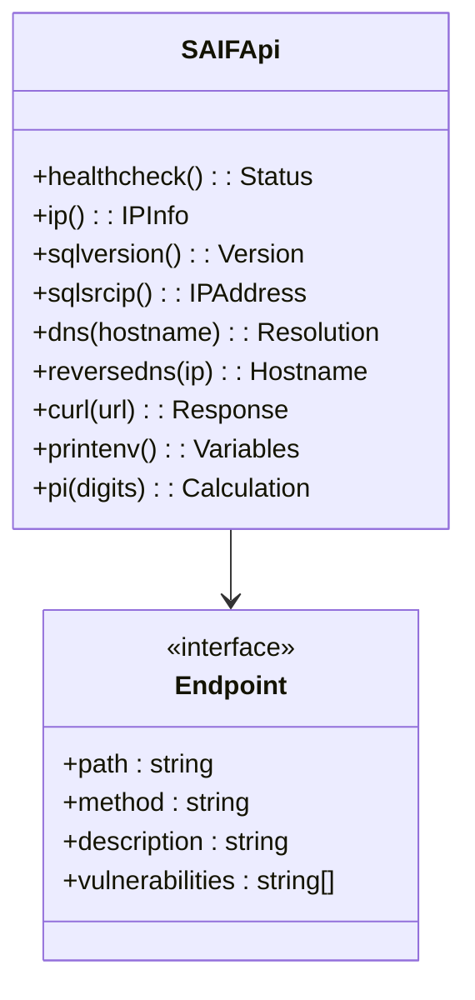

# API Component for SAIF

[](https://www.python.org/)
[](https://fastapi.tiangolo.com/)
[](https://www.sqlalchemy.org/)
[](../docker-compose.yml)

Python-based API that provides various diagnostic endpoints for testing and learning about security concepts.



## Endpoints

The API provides the following endpoints:

- `/api/healthcheck` - Simple health check
- `/api/ip` - Returns IP address information
- `/api/sqlversion` - Returns the SQL Server version
- `/api/sqlsrcip` - Returns the source IP as seen by SQL Server
- `/api/dns` - Resolves a DNS name
- `/api/reversedns` - Performs reverse DNS lookup
- `/api/curl` - Makes an HTTP request to a specified URL
- `/api/printenv` - Returns environment variables
- `/api/pi` - Calculates PI to test CPU load

## Setup

```bash
pip install -r requirements.txt
```

## Running Locally

```bash
uvicorn app:app --reload
```

## Environment Variables

- `SQL_SERVER` - SQL Server hostname
- `SQL_DATABASE` - Database name
- `SQL_USERNAME` - SQL username
- `SQL_PASSWORD` - SQL password
- `API_KEY` - Optional API key for authentication (deliberately insecure)
