# Azure PostgreSQL HA Architecture

**Version**: 2.0.0  
**Last Updated**: October 16, 2025  
**Status**: Current

## System Architecture Overview

```mermaid
graph TB
    subgraph Azure["☁️ Azure Cloud - Sweden Central"]
        subgraph Zone1["🔵 Availability Zone 1"]
            Web["🌐 Web App Service<br/>(PHP/Apache)<br/>Port 80<br/>(Zonal)"]
            API["⚡ API App Service<br/>(FastAPI)<br/>Port 8000<br/>(Zonal)"]
            PrimaryDB["🗄️ PostgreSQL Primary<br/>Standard_D4ds_v5<br/>Port 5432<br/>128GB Premium SSD"]
            Monitor["📊 Application Insights<br/>& Log Analytics"]
        end
        
        subgraph Zone2["🔷 Availability Zone 2"]
            StandbyDB["🗄️ PostgreSQL Standby<br/>Hot Standby (Read Replica)<br/>Synchronous Replication"]
        end
        
        subgraph Support["🛠️ Supporting Services"]
            KeyVault["🔐 Azure Key Vault<br/>(Secrets & Creds)"]
            ACR["📦 Azure Container Registry<br/>(Docker Images)"]
            Backup["💾 Azure Backup<br/>(7-day retention)"]
        end
        
        LoadGen["🔄 Load Generator<br/>(Optional - ACI)<br/>12,600+ TPS Capacity"]
    end
    
    Users["👥 End Users<br/>(Web Browsers)"]
    
    Users -->|"HTTPS (443)"| Web
    Web -->|"HTTP (8000)"| API
    API -->|"PostgreSQL (5432)"| PrimaryDB
    LoadGen -.->|"Load Testing"| API
    
    PrimaryDB ==>|"Synchronous Replication<br/>RPO = 0 (Zero Data Loss)"| StandbyDB
    PrimaryDB -->|"Telemetry"| Monitor
    API -->|"Telemetry"| Monitor
    Web -->|"Telemetry"| Monitor
    
    StandbyDB -.->|"Automatic Failover<br/>RTO: 60-120s"| PrimaryDB
    
    PrimaryDB -.->|"Get Secrets"| KeyVault
    API -.->|"Get Secrets"| KeyVault
    Web -.->|"Pull Images"| ACR
    API -.->|"Pull Images"| ACR
    PrimaryDB -.->|"Automated Backups"| Backup
    
    classDef primary fill:#4A90E2,stroke:#2E5C8A,stroke-width:3px,color:#fff
    classDef standby fill:#87CEEB,stroke:#4A90E2,stroke-width:2px,color:#000
    classDef app fill:#52C41A,stroke:#389E0D,stroke-width:2px,color:#fff
    classDef support fill:#FFA940,stroke:#D46B08,stroke-width:2px,color:#fff
    classDef monitor fill:#722ED1,stroke:#531DAB,stroke-width:2px,color:#fff
    classDef users fill:#F5222D,stroke:#A8071A,stroke-width:2px,color:#fff
    classDef loadgen fill:#FA8C16,stroke:#D46B08,stroke-width:2px,color:#fff
    
    class PrimaryDB primary
    class StandbyDB standby
    class Web,API app
    class KeyVault,ACR,Backup support
    class Monitor monitor
    class Users users
    class LoadGen loadgen
```



**Architecture Highlights:**
- **App Service is Zonal**: Web/API App Service deployed in single zone (Zone 1) for lowest latency
- **Zone-Redundant HA for PostgreSQL**: Primary (Zone 1) and Standby (Zone 2) for 99.99% SLA
- **Zero Data Loss**: Synchronous replication ensures RPO = 0
- **Automatic Failover**: RTO of 60-120 seconds with DNS update
- **Load Testing**: Optional ACI-based load generator (12,600+ TPS validated)
- **Monitoring**: Centralized telemetry with Application Insights

## Database Schema

**Complete schema:** [database/init-db.sql](../database/init-db.sql)

**8 Tables:** customers, merchants, payment_methods, transactions, orders, order_items, transaction_logs  
**2 Views:** merchant_transaction_summary  
**1 Function:** create_test_transaction()

## High Availability Configuration

```yaml
Database: Azure PostgreSQL Flexible Server 16
HA Mode: Zone-Redundant
Compute: Standard_D4ds_v5 (4 vCore, 16 GB RAM)
Storage: 128 GB Premium SSD (P10)
SLA: 99.99% uptime
RPO: 0 seconds (zero data loss)
RTO: 60-120 seconds (automatic failover)
```

## Performance Specifications

### Default Configuration
- **Compute:** Standard_D4ds_v5 (4 vCores, 16 GB RAM)
- **Storage:** 128 GB Premium SSD
- **Throughput:** ~300 TPS (failover testing)
- **Cost:** ~$675/month

### High-Performance Configuration  
- **Compute:** Standard_D16ds_v5 (16 vCores, 64 GB RAM)
- **Storage:** 8 TB P60 (16K IOPS, 500 MB/s)
- **Throughput:** 12,600+ TPS validated
- **Cost:** ~$2,705/month

---

**Related Documentation:**
- [Deployment Guide](deployment-guide.md) - Setup and configuration
- [Testing Guide](testing-guide.md) - Load testing and failover procedures
- [Main README](../README.md) - Project overview