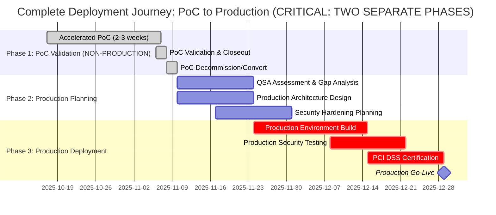
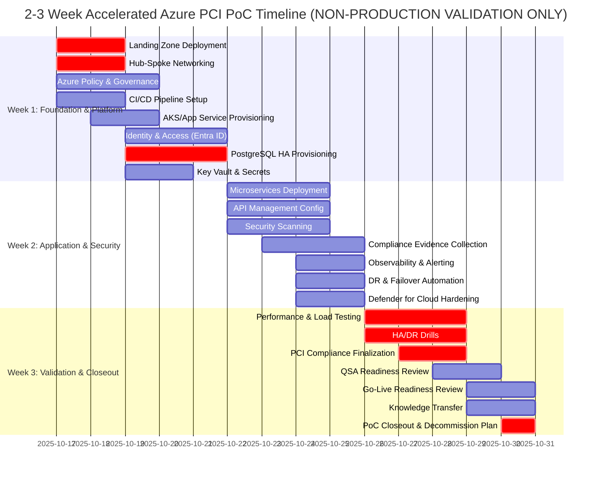
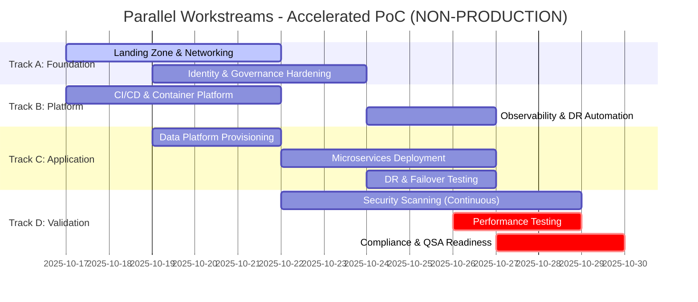
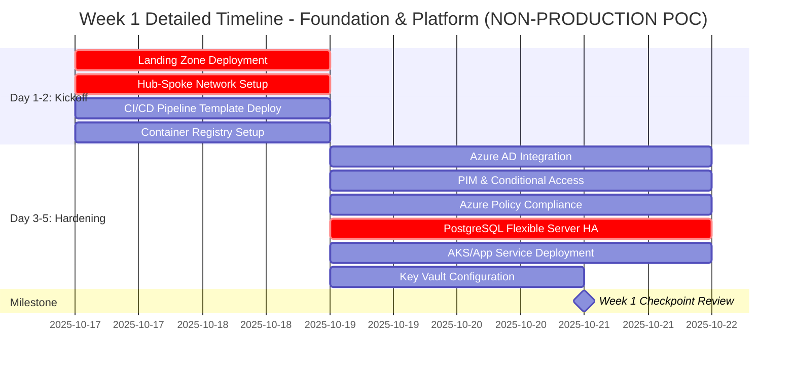
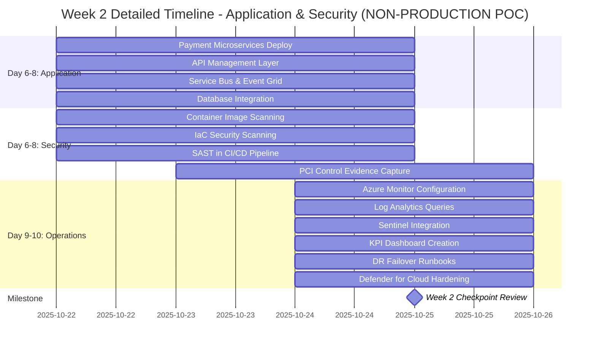
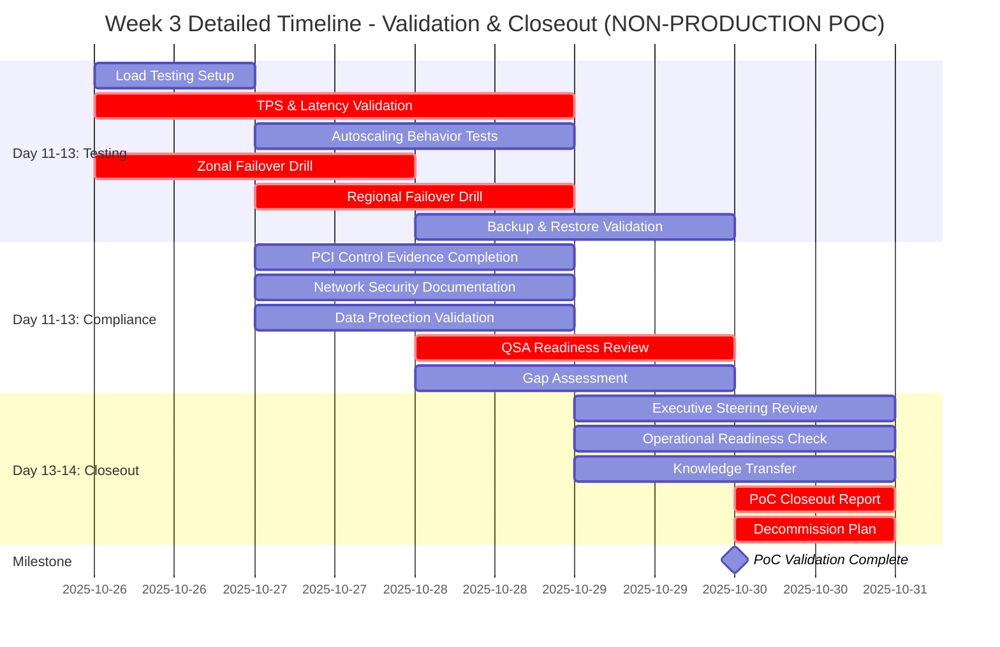

# Azure PCI-Compliant Build Proof of Concept (PoC) - Accelerated Delivery (2-3 Weeks)

**Version**: 1.0.0  
**Last Updated**: October 17, 2025  
**Document Owner**: Cloud Architecture Team  
**Status**: Active Planning Document

## Table of Contents

- [Executive Summary](#executive-summary)
- [Scope and Context](#scope-and-context)
- [Accelerated Delivery Strategy](#accelerated-delivery-strategy)
- [Compressed Timeline: 2-3 Weeks](#compressed-timeline-2-3-weeks)
- [Success Criteria & KPIs](#success-criteria--kpis-compressed-validation)
- [Compressed Testing & Validation Plan](#compressed-testing--validation-plan)
- [Accelerated Governance & Operations](#accelerated-governance--operations)
- [Risks & Mitigations](#risks--mitigations-accelerated-context)
- [Deliverables](#deliverables-same-as-full-length-poc)
- [Acceleration Enablers](#acceleration-enablers)
- [Next Steps](#next-steps-go-live-path)
- [References](#references)

## Executive Summary

> **⚠️ PROOF OF CONCEPT ENVIRONMENT - NOT FOR PRODUCTION USE**
>
> **CRITICAL DISCLAIMER**: This document describes a **non-production proof of concept (PoC) environment** for evaluation and validation purposes ONLY. This accelerated PoC is **NOT intended for production deployment** or live transaction processing. Key limitations:
>
> - **No Production Data**: Do not import or process live payment data, production cardholder information, or real customer transactions
> - **Isolated Evaluation**: This PoC operates as an isolated validation environment and must remain completely separate from production systems
> - **Time-Limited**: PoC environment should be decommissioned or converted to dev/test after validation is complete
> - **Not Production-Ready**: While PCI DSS controls are demonstrated for validation, full production hardening, QSA certification, and additional security measures are required before any live deployment
> - **Compliance Status**: This PoC demonstrates compliance readiness concepts but does NOT constitute PCI DSS certification or production approval
> - **Production Path**: Successful PoC validation must be followed by a separate, dedicated production deployment with comprehensive QSA assessment, security hardening, and formal certification processes
>
> **DO NOT** use this PoC environment for live transactions, production data, or customer-facing services.

This document outlines an **accelerated delivery plan** to deploy a greenfield Azure Build-Out PoC for a **PCI DSS–compliant payment gateway** workload in **2-3 weeks**. The PoC establishes a non-production validation environment with all original deliverables and scope compressed through parallel workstreams, pre-built templates, and focused prioritization.

> **Note**: For a more detailed, sequential approach with extended time for training and knowledge transfer, see the [standard 6-week PoC plan](./azure-pci-compliant-build-poc.md).

### PoC vs Production Deployment Timeline

This critical timeline visualization shows the complete journey from PoC to Production, emphasizing that the accelerated PoC is only the **first phase** of a larger deployment process.



**Key Takeaway**: The PoC (Phase 1) is **NON-PRODUCTION ONLY** and must be followed by separate production planning and deployment phases (Phases 2-3) before any live transaction processing.

### Accelerated vs. Standard Timeline Comparison

| Aspect | Accelerated (2-3 Weeks) | Standard (6 Weeks) |
|--------|------------------------|-------------------|
| **Environment Type** | **NON-PRODUCTION PoC** | **NON-PRODUCTION PoC** |
| **Team Commitment** | 100% dedicated, 5.5 FTE | Partial allocation, 6-8 FTE |
| **Workstream Model** | Parallel execution from Day 1 | Sequential with some overlap |
| **Pre-Built Assets** | Required (templates, policies, reference architectures) | Helpful but not mandatory |
| **Training & Knowledge Transfer** | Minimal, assumes existing Azure expertise | Comprehensive, includes skill development |
| **Risk Tolerance** | Higher, requires experienced team | Lower, allows for learning curve |
| **Decision Velocity** | Daily steering committee, <4 hour approvals | Weekly reviews, standard approvals |
| **Ideal For** | Experienced Azure teams, urgent **validation** needs | First Azure workload, skill development focus |
| **Post-Completion** | **Decommission or convert to dev/test** | **Decommission or convert to dev/test** |

### Key Success Factors
- **Non-Production PoC Environment**: All objectives are for validation purposes only, not production deployment
- **PCI DSS v4.0 alignment** across people, process, and technology controls (demonstration of compliance readiness concepts)
- **Near-zero data loss** (Recovery Point Objective ≤ 5 seconds) with **downtime under 30 seconds** during failover events (Recovery Time Objective ≤ 30 seconds) in PoC validation environment
- **Azure-first landing zone** built according to the **Microsoft Cloud Adoption Framework (CAF)** and **Azure Well-Architected Framework (WAF)**
- Accelerated delivery through **parallel workstreams, pre-configured templates, and MVP-focused scope**
- **Clear separation** from production systems with documented decommissioning or conversion plan

## Scope and Context

### Prerequisites

Before starting this accelerated PoC, ensure the following prerequisites are met:

- **Azure Subscription**: Active Azure subscription with sufficient quota for enterprise-grade resources
- **Executive Sponsorship**: Confirmed executive sponsor and steering committee with daily availability for rapid decisions
- **Budget Approval**: Approved budget for 2-3 week accelerated PoC sprint
- **Team Availability**: Dedicated team members (5.5 FTE) with 100% allocation for the engagement period
- **Access & Permissions**: Global Admin or Owner access to Azure subscription and Microsoft Entra ID tenant
- **Compliance Requirements**: PCI DSS v4.0 documentation and QSA engagement timeline confirmed
- **Network Planning**: IP address ranges pre-allocated for Azure Virtual Networks (hub and spoke)
- **Identity Foundation**: Microsoft Entra ID tenant available for integration
- **Pre-Built Assets**: Confirmed availability of CAF templates, policy initiatives, and reference architectures
- **Skills Readiness**: Team familiar with Azure services or pre-trained on key technologies

> **⚠️ Critical Success Factor**: Unlike the standard 6-week PoC, the accelerated timeline requires immediate availability of all prerequisites and team members. Any delays in securing these items will directly impact the delivery schedule.

### Project Scope

> **⚠️ NON-PRODUCTION POC SCOPE REMINDER**
>
> This is a **validation and evaluation environment ONLY**. Do not confuse PoC completion with production readiness. A separate production deployment project is required after PoC validation.

| Dimension | Details |
|-----------|---------|
| **Environment Type** | **NON-PRODUCTION Proof of Concept for Evaluation Only** |
| Deployment Strategy | Isolated Azure PoC build, no data synchronization with production systems, no cutover to live environment. |
| Data Handling | Greenfield databases with **synthetic/test data only** - absolutely NO production data import. |
| PoC Completion Model | Validation and acceptance criteria verification only - **NOT a production go-live**. |
| Production Deployment | **Separate production deployment required** after PoC validation and QSA certification. |
| On-Premises Systems | Remain unchanged; PoC operates as isolated validation environment. |
| Landing Zone | First Azure workload; landing zone created for PoC validation purposes. |
| **Acceleration Method** | **Parallel workstreams, enterprise-scale templates, pre-built compliance baselines, and focused MVP scope.** |
| **Post-PoC Action** | Environment decommissioned or converted to dev/test after validation - **NOT promoted to production**. |

## Accelerated Delivery Strategy

### Parallel Workstreams (Weeks 1-3)

The traditional 6-week sequential plan is compressed into three parallel tracks:

| Track | Focus | Team | Parallel Execution |
|-------|-------|------|-------------------|
| **Track A: Foundation** | Landing Zone, networking, identity, governance baselines | Infrastructure Lead + Security Engineer | Weeks 1-2 |
| **Track B: Platform** | CI/CD, AKS/App Service, Key Vault, monitoring setup | Platform Engineer + DevOps Lead | Weeks 1-2 |
| **Track C: Application** | Payment microservices, PostgreSQL HA, data integration | Application Lead + Database Specialist | Weeks 1-3 |
| **Track D: Validation** | Security scanning, compliance checks, performance testing, DR drills | QA Lead + Security/Compliance Specialist | Weeks 2-3 |

### Pre-Built Assets & Reusable Templates

**Assumption**: Leverage Microsoft CAF enterprise-scale landing zone bicep templates and pre-configured PCI baseline policies to reduce build time by ~40%.

- Enterprise-scale hub-spoke topology (Bicep templates)
- PCI DSS Azure Policy initiative (baseline guardrails)
- Payment gateway reference architecture (containerized microservices)
- Pre-configured Azure Monitor alert rules and Log Analytics queries
- Runbook library for failover, backup/restore, and incident response

## Compressed Timeline: 2-3 Weeks

> **⚠️ TIMELINE DISCLAIMER**: This accelerated timeline is for **PoC validation purposes only**. Do not use this schedule as a production deployment timeline. Production deployments require additional time for comprehensive security hardening, QSA certification, load testing, and operational readiness that are beyond the scope of this PoC.

### Overall Timeline Visualization

The following Gantt chart provides a high-level view of the entire 2-3 week accelerated PoC timeline, showing how parallel workstreams enable rapid delivery. Note that this is a **non-production validation environment** with compressed timelines not suitable for production deployment.



### Parallel Workstream Visualization

This chart shows how the four parallel tracks (Foundation, Platform, Application, and Validation) execute simultaneously to achieve the accelerated timeline. This aggressive parallelization is only appropriate for **PoC validation environments** with experienced teams.



### Critical Milestones & Decision Gates

This timeline visualizes critical milestones and decision gates throughout the PoC. Each gate requires explicit approval before proceeding to the next phase, ensuring stakeholders understand this is a **non-production validation environment**.

```mermaid
gantt
    title Critical Decision Gates - Accelerated PoC (NON-PRODUCTION VALIDATION)
    dateFormat YYYY-MM-DD
    section Gates & Milestones
    Gate 0: PoC Kickoff & Scope Confirmation        :milestone, gate0, 2025-10-17, 0d
    Gate 1: Foundation Ready (Week 1 End)           :milestone, gate1, 2025-10-21, 0d
    Gate 2: Application Deployed (Week 2 End)       :milestone, gate2, 2025-10-25, 0d
    Gate 3: Validation Complete (Week 3 Mid)        :milestone, gate3, 2025-10-28, 0d
    Gate 4: PoC Closeout (NOT Production Go-Live)   :crit, milestone, gate4, 2025-10-30, 0d
    section Validation Activities
    Week 1 Foundation Build                         :foundation, 2025-10-17, 5d
    Week 2 Application & Security                   :application, 2025-10-22, 4d
    Week 3 Testing & Validation                     :crit, validation, 2025-10-26, 4d
    PoC Decommission Planning                       :crit, decom, 2025-10-30, 1d
```

**Decision Gate Criteria**:
- **Gate 0**: Executive approval, team availability, pre-built assets validated, **PoC scope confirmed as non-production**
- **Gate 1**: Landing zone operational, CI/CD functional, data platform ready, **clear separation from production systems**
- **Gate 2**: Microservices deployed, security scans complete, observability enabled, **synthetic data only**
- **Gate 3**: Performance validated, DR drills passed, compliance evidence collected, **PoC objectives met**
- **Gate 4**: **PoC validation complete** - closeout report delivered, decommission/conversion plan approved, **production deployment project separately initiated**

### Week 1: Foundation & Platform Enablement (Parallel)

#### **Day 1-2: Kickoff & Landing Zone Deployment (Track A)**
- Executive sponsorship and steering committee established
- CAF enterprise-scale template customized and deployed:
  - Management groups, subscriptions, and RBAC roles
  - Hub-spoke networking with Azure Firewall, DDoS Protection Standard, private DNS
  - Azure Policy assignments (PCI baseline guardrails, tagging standards)
  - Baseline diagnostics and Log Analytics workspace configured
- **Deliverable**: Landing zone blueprint and network topology diagram

#### **Day 1-2: CI/CD & Platform Setup (Track B)**
- GitHub Actions or Azure DevOps CI/CD pipeline template deployed
- Container registry (ACR) and artifact management configured
- AKS cluster or App Service environment provisioned with:
  - Managed identities and Key Vault integration
  - Deployment slots for blue/green releases
  - Application Gateway (WAF v2) with autoscaling rules
- **Deliverable**: CI/CD pipeline ready for application deployment

#### **Day 3-5: Identity & Governance Hardening (Track A)**
- Azure AD (Entra ID) integration:
  - Conditional Access policies for payment gateway admins
  - Privileged Identity Management (PIM) setup for break-glass access
  - Azure AD B2C tenant for customer-facing flows (if applicable)
- Azure Policy compliance dashboard active; non-compliant resources remediated
- Tagging strategy enforced via policy
- **Deliverable**: Identity and access control baseline

#### **Day 3-5: Data Platform Provisioning (Track C)**
- **PostgreSQL Flexible Server** deployed with:
  - Zone-redundant HA enabled (sync replication, RPO ≤ 5s)
  - Encryption at rest (TDE) and in transit (SSL/TLS)
  - Automated daily backups with geo-redundant replication (RA-GRS)
  - Audit logging and column masking policies
- **Azure Cosmos DB** provisioned for session/state (optional for initial MVP)
- **Azure Storage** account configured for immutable audit logs
- **Deliverable**: Data tier architecture and baseline database schema

#### **End of Week 1 Checkpoint**
- Landing zone fully operational with governance in place
- CI/CD pipeline tested and ready for deployments
- Data platform ready to ingest microservices
- All identity and access controls baseline-configured

#### **Week 1 Detailed Timeline Visualization**

This detailed Gantt chart shows the day-by-day activities during Week 1, highlighting the intensive parallel execution required for accelerated PoC delivery.



---

### Week 2: Application Deployment & Security Hardening (Parallel)

#### **Day 6-8: Payment Microservices Deployment (Track C)**
- Core payment microservices containerized and deployed to AKS/App Service:
  - Authorization service, settlement service, reconciliation service
  - API Management layer for rate limiting and authentication
  - Azure Service Bus for async event processing
  - Event Grid for fraud analytics and notifications
- Database integration with encrypted connection strings managed via Key Vault
- Telemetry and Application Insights instrumentation enabled
- **Deliverable**: Payment gateway microservices running in dev/staging

#### **Day 6-8: Security & Compliance Validation (Track D)**
- **Automated Security Scanning**:
  - Container image scanning via Defender for Cloud
  - IaC scanning for Bicep templates (Policy violations, security misconfigs)
  - SAST scanning in CI/CD pipeline (code vulnerabilities)
- **Compliance Evidence Capture**:
  - PCI DSS control mapping document (network diagrams, encryption configs, access reviews)
  - Automated evidence collection via Azure Policy compliance reports
  - Audit log retention and immutable storage validation
- **Defender for Cloud** hardening:
  - Enable Defender plans (servers, containers, databases, key vault)
  - Remediate high-severity recommendations (80%+ closure target)
  - Secure Score ≥ 80% verified
- **Deliverable**: Security scan reports, compliance evidence catalog, Secure Score dashboard

#### **Day 9-10: Observability & Alerting (Track B)**
- **Azure Monitor** configuration:
  - Centralized alert rules for payment failures, high latency, database replication lag
  - Log Analytics workspace queries for fraud spikes, security events, access anomalies
  - Microsoft Sentinel (SIEM/SOAR) integration for correlation and automated playbooks
- **KPI Dashboard** created (Power BI or Azure Monitor Workbook):
  - Real-time RPO/RTO metrics
  - Payment API availability and transaction response times
  - Compliance and security posture indicators
- **Integration**: Teams/ServiceNow channels for alert routing and incident management
- **Deliverable**: Observability baseline and KPI dashboard

#### **Day 9-10: DR & Failover Automation (Track C)**
- **Automated failover runbooks** created:
  - Database failover (zonal HA promotion, geo-standby activation)
  - Application failover (Traffic Manager/Front Door routing updates)
  - DNS and certificate updates via Azure Automation
- **Initial DR drill** scheduled for Week 3
- **Deliverable**: Failover runbook library and initial validation

#### **End of Week 2 Checkpoint**
- Payment microservices deployed and operational
- Security scanning complete; compliance evidence 70%+ collected
- Observability and alerting fully operational
- DR automation tested in non-prod environment

#### **Week 2 Detailed Timeline Visualization**

Week 2 focuses on application deployment and security hardening with continuous validation. This visualization shows the overlapping activities that enable rapid progress in the **PoC validation environment**.



---

### Week 3: Validation, Testing & Go-Live Readiness

#### **Day 11-13: Performance & Resiliency Testing (Track D)**
- **Load Testing** (Azure Load Testing / K6):
  - Validate ≥ 1,500 TPS sustainment with ≤ 1% errors
  - Confirm P99 latency ≤ 200 ms for authorization requests
  - Verify autoscaling behavior under peak load
  - Results fed back to application team for tuning
- **HA/DR Drills** (compressed, focused on critical paths):
  - **Zonal failover drill**: PostgreSQL zone failure → promote standby (validate RTO ≤ 30s, RPO ≤ 5s)
  - **Regional failover drill**: Simulated region outage → Traffic Manager failover (validate application recovery)
  - Runbooks executed and timed; document any gaps for remediation
- **Backup & Restore Validation**:
  - Execute full backup restore to staging environment
  - Verify data integrity and recovery time targets
- **Deliverable**: Performance test report, DR drill results, RTO/RPO validated

#### **Day 11-13: Compliance Finalization & QSA Readiness (Track D)**
- **PCI DSS Control Evidence Completion** (target 95%+ closure):
  - Network security controls documented (firewall rules, NSGs, WAF configs)
  - Data protection controls confirmed (encryption at rest/in transit, key management)
  - Access control reviews finalized (Azure AD assignments, PIM audit logs)
  - Monitoring & logging controls validated (365-day retention, export to immutable storage)
  - Incident response playbooks and Sentinel automation reviewed
- **QSA Readiness Review**:
  - Internal gap assessment against PCI DSS v4.0 requirements
  - High-risk findings remediated; medium/low risks documented with mitigations
  - Evidence repository organized and accessible (SharePoint/Teams)
- **Governance Sign-Off**: All CAF governance disciplines (Cost, Security, Resource Consistency, Identity Baseline, Deployment Acceleration) verified
- **Deliverable**: PCI DSS readiness report, evidence catalog, QSA pre-assessment checklist

#### **Day 13-14: Go-Live Readiness Review & Knowledge Transfer**
- **Executive Steering Committee** final review:
  - Technical KPIs achieved (RPO, RTO, availability, TPS, response time, secure score, policy compliance)
  - Business KPIs projected (authorization success rate, compliance audit readiness, cost predictability)
  - Residual risks documented and accepted
- **Operational Readiness**:
  - On-call rotation and escalation procedures defined
  - Runbook library socialized with ops team
  - Break-glass access procedures validated
  - ITSM integration (ServiceNow/Jira) tested
- **Knowledge Transfer Artifacts**:
  - Operational runbooks (deployment, failover, incident response, backup/restore)
  - Architecture decision records (ADRs) and design documentation
  - Troubleshooting guides and FAQ
  - Post-launch support model agreed upon
- **Go-Live Approval**: Steering committee approves production deployment window
- **Deliverable**: PoC Closeout Report, operational runbooks, go-live checklist

#### **End of Week 3 Checkpoint**
- All technical KPIs validated and met in **PoC environment**
- Compliance evidence 95%+ complete; QSA-ready **for PoC assessment**
- DR drills passed with proven RTO/RPO targets **in validation environment**
- PoC validation complete; **separate production deployment project** can be initiated

> **⚠️ IMPORTANT**: Week 3 completion marks the end of **PoC VALIDATION ONLY**. This is NOT a production go-live. A separate production deployment project with full QSA certification is required before any live transaction processing.

#### **Week 3 Detailed Timeline Visualization**

Week 3 is the critical validation phase where all PoC objectives are tested and verified. This chart shows the intensive testing and validation activities required to complete the **non-production PoC**.



---

## Success Criteria & KPIs (Compressed Validation)

> **⚠️ POC VALIDATION TARGETS ONLY**: The KPIs below are **validation targets for the non-production PoC environment**. Production KPIs and SLAs will need to be separately defined, validated, and agreed upon before any production deployment. Meeting these PoC targets does NOT automatically qualify the environment for production use.

### Technical KPIs

| KPI | Target | Validation Method | Week |
|-----|--------|--------------------|------|
| **Recovery Point Objective (RPO)** | ≤ 5 seconds | Database failover drill; replication lag metrics in Azure Monitor | Week 3 |
| **Recovery Time Objective (RTO)** | ≤ 30 seconds | Zonal and regional failover drills with timing measurements | Week 3 |
| **Payment API Availability** | ≥ 99.95% during PoC | Synthetic probes (1-min intervals) across two regions | Week 3 |
| **Transaction Response Time (P99)** | ≤ 200 ms | Application Insights under peak load (1,500 TPS) | Week 3 |
| **TPS Sustainment** | ≥ 1,500 TPS with ≤ 1% errors | Azure Load Testing or K6 with 2× peak volume | Week 3 |
| **Security Posture (Secure Score)** | ≥ 80% | Defender for Cloud dashboard (landing zone scope) | Week 2 |
| **Policy Compliance** | 100% adherence to PCI guardrails | Azure Policy compliance report; no high-severity violations | Week 2 |
| **Backup Success Rate** | 100% daily backups validated | Restore validation in staging environment | Week 3 |
| **Secrets Rotation** | Automated ≤ 30 days | Key Vault audit logs and policy compliance | Week 1 |
| **Change Lead Time** | ≤ 24 hours (PR → production) | CI/CD pipeline metrics | Week 2 |

### Business KPIs

| KPI | Target | Validation Method | Week |
|-----|--------|--------------------|------|
| **Payment Authorization Success Rate** | ≥ 99% | Event data analytics dashboards | Week 3 |
| **Chargeback Reduction** | ≥ 10% vs. on-prem baseline | Fraud analytics comparison (historical data) | Week 3 |
| **Compliance Audit Readiness** | PCI DSS interim assessment passed | QSA pre-assessment and evidence catalog | Week 3 |
| **Operational Efficiency** | Reduce manual intervention by 40% | Automated vs. manual incident resolution metrics | Week 3 |
| **Cost Predictability** | ±10% variance (forecast vs. actual) | Azure Cost Management budgets and variance reports | Week 2 |
| **Stakeholder Satisfaction** | ≥ 8/10 | Exec steering committee and ops team feedback | Week 3 |

---

## Compressed Testing & Validation Plan

### Performance Testing
- **Duration**: 2-3 days (Week 3)
- **Scope**: Peak transaction loads, TPS/latency validation, autoscaling behavior
- **Tool**: Azure Load Testing or K6
- **Pass Criteria**: ≥ 1,500 TPS, P99 ≤ 200 ms, ≤ 1% errors

### Security Validation
- **Duration**: Continuous throughout Weeks 1-3
- **Automated Scans**: Container images, IaC templates, code vulnerabilities
- **Manual Review**: 1-2 penetration testing sessions (focused on payment APIs and data access)
- **Defender for Cloud**: Weekly remediation rounds targeting ≥ 80% Secure Score

### Compliance Audits
- **Duration**: Weeks 2-3
- **Scope**: PCI DSS control evidence collection, gap analysis, remediation
- **Deliverable**: Evidence repository and QSA pre-assessment checklist

### DR/Resiliency Drills
- **Schedule**: Week 3 (1-2 focused drills)
- **Scope**: Zonal failover, regional failover, backup/restore
- **Metrics**: Validate RTO ≤ 30s, RPO ≤ 5s
- **Output**: Updated runbooks, timing logs, lesson-learned list

---

## Accelerated Governance & Operations

### Change Management
- **GitOps-Driven**: All infrastructure and policy changes via pull requests
- **Automated Checks**: Azure Policy compliance gates in CI/CD pipeline
- **Approval Workflow**: Streamlined approvals for PoC pace (≤ 4 hours)

### Monitoring & Alerting
- **Centralized Dashboards**: Azure Monitor and Sentinel integration
- **Alert Routing**: Teams channels for incidents, daily standup metrics
- **SLA Targets**: Payment failures ≤ 2 min MTTR, security events ≤ 5 min response

### Incident Response
- **Sentinel Playbooks**: Automated actions for fraud spikes, WAF anomalies, replication lag
- **On-Call Model**: Defined before go-live; rotations managed via PagerDuty/Teams

### Cost Control
- **Budgets**: Set at 110% of forecast to flag overruns early
- **Weekly Reviews**: Bi-weekly cost analysis with optimization recommendations

---

## Risks & Mitigations (Accelerated Context)

> **⚠️ POC RISK CONTEXT**: The risks and mitigations below are specific to the **non-production PoC validation environment**. Production deployments will require additional risk assessment and mitigation strategies beyond what is described here.

| Risk | Impact | Mitigation |
|------|--------|------------|
| **Compressed timeline delays foundational work** | Cascading schedule impact | Parallel workstreams; pre-built templates; daily standups; escalation to steering committee |
| **Incomplete PCI compliance evidence** | Go-live blocked | Automated evidence capture in CI/CD; compliance backlog prioritized from Day 1; QSA alignment early |
| **Performance targets not met** | Rework required | Early load modeling; staging environment mirrors production; K6 tests run daily from Week 2 |
| **Security misconfiguration in rapid deployment** | Breach risk | Continuous policy enforcement, daily Defender for Cloud reviews, SAST in every commit |
| **Skill gaps on Azure services** | Operational risk | Pre-PoC training; pair Azure specialists with on-prem SMEs; runbooks with detailed steps |
| **DR drill failures** | Runbook ineffective | Conduct drills mid-Week 3 with time for refinement; schedule second drill if needed |
| **PoC environment mistaken for production-ready** | Premature production deployment; security/compliance violations | Clear disclaimers in all documentation; separate PoC and production subscriptions; explicit decommission/conversion planning; executive steering committee reinforcement of PoC scope |
| **Production data imported into PoC** | PCI compliance violation; security breach | Strict data handling policies; synthetic data only; automated scanning for sensitive data patterns; isolated network with no production connectivity |

---

## Deliverables (Same as Full-Length PoC)

> **⚠️ POC DELIVERABLES DISCLAIMER**: All deliverables are scoped for **non-production PoC validation** purposes. These deliverables demonstrate concepts and feasibility but require significant enhancement, hardening, and validation before use in production environments. Production-ready versions of these deliverables must be developed as part of a separate production deployment project.

1. **Landing Zone Blueprint** aligned with CAF enterprise-scale architecture (Bicep templates + documentation) - **PoC validation version only**.
2. **Payment Gateway Reference Architecture** diagrams, IaC templates, and microservices codebase - **for evaluation purposes, not production deployment**.
3. **PCI DSS Control Implementation Guide** with automated evidence cataloging procedure and compliance dashboards - **demonstrates compliance readiness concepts, not full certification**.
4. **Runbooks** for deployment, failover, incident response, backup/restore, and break-glass access - **PoC validation procedures, require production hardening**.
5. **KPI Dashboard** (Power BI or Azure Monitor Workbook) tracking real-time technical and business metrics - **configured for PoC validation targets**.
6. **PoC Closeout Report** summarizing outcomes, validation results, lessons learned, and **recommendations for production deployment** - including clear separation between PoC achievements and production requirements.

---

## Acceleration Enablers

### Pre-Built Assets Required

| Asset Category | Specific Items | Source/Repository |
|---------------|----------------|-------------------|
| **Infrastructure Templates** | - CAF enterprise-scale landing zone (Bicep/ARM)<br>- Hub-spoke networking templates<br>- AKS/App Service baseline configurations | [Azure Landing Zone Accelerators](https://github.com/Azure/Enterprise-Scale) |
| **Policy Initiatives** | - PCI DSS v4.0 Azure Policy initiative<br>- Tagging enforcement policies<br>- Encryption and security baseline policies | [Azure Policy Samples](https://github.com/Azure/azure-policy) |
| **Application Code** | - Payment gateway reference microservices (containerized)<br>- API Management policy templates<br>- Service Bus/Event Grid integration samples | Custom or partner reference architecture |
| **Monitoring & Observability** | - Azure Monitor baseline alert rules<br>- Log Analytics KQL queries<br>- Azure Workbooks for KPI dashboards<br>- Application Insights instrumentation | [Azure Monitor Community](https://github.com/microsoft/Application-Insights-Workbooks) |
| **Operational Runbooks** | - Failover automation scripts<br>- Incident response playbooks<br>- Break-glass access procedures<br>- Backup/restore procedures | Custom development required |
| **Documentation Templates** | - Architecture decision records (ADRs)<br>- Compliance evidence collection forms<br>- Runbook templates | Custom or CAF templates |

**Pre-Deployment Validation Checklist**:
- [ ] All templates tested in sandbox subscription
- [ ] Policy initiatives validated for conflicts
- [ ] Reference application builds and deploys successfully
- [ ] Monitoring dashboards render correctly with sample data
- [ ] Runbooks execute without errors in test environment

### Team Structure & Skills
- **Infrastructure Lead** (1 FTE): CAF landing zone, networking, Azure Firewall
- **Security Engineer** (1 FTE): Azure AD, Key Vault, Defender for Cloud, PCI compliance
- **Platform Engineer** (1 FTE): CI/CD, container orchestration, observability
- **Application Lead** (1 FTE): Microservices, API Management, database integration
- **DevOps Lead** (0.5 FTE): Runbook automation, AKS/App Service operations
- **Database Specialist** (0.5 FTE): PostgreSQL HA, backup/recovery, data protection
- **QA/Security Lead** (1 FTE): Performance testing, penetration testing, compliance validation

**Total Capacity**: ~5.5 FTE (may vary based on existing Azure expertise)

### Daily Cadence
- **9:00 AM**: 15-min standup across all tracks (async updates accepted)
- **2:00 PM**: Blocking issue resolution and escalation to steering committee (as needed)
- **3:00 PM**: Daily Secure Score and policy compliance review (Track D)

### Weekly Cadence
- **Friday 4:00 PM**: Track leads review progress against Week's milestones; adjust priorities for next week
- **Monday 9:00 AM**: Steering committee alignment on blockers and risks

---

## Lessons Learned & Best Practices

### What Makes Accelerated Delivery Successful

**Team Characteristics**:
- Prior Azure experience with similar workloads
- Cross-functional team with overlapping skills (reduce single points of failure)
- Co-located or highly synchronized remote team (same time zones preferred)
- Empowered to make technical decisions without lengthy approval chains

**Organizational Readiness**:
- Executive sponsorship with authority to break through blockers
- Pre-approved budget with emergency contingency
- Clear scope boundaries with "no scope creep" discipline
- Acceptance that some documentation will be completed post-deployment

**Technical Preparedness**:
- Sandbox environment for template validation before Day 1
- Reference architecture already aligned with business requirements
- Network architecture pre-approved by security team
- Third-party integrations (QSA tooling, SIEM, ticketing) APIs documented

### Common Pitfalls to Avoid

| Pitfall | Impact | Prevention Strategy |
|---------|--------|---------------------|
| **"We'll figure it out as we go"** | 2-3 day delays per decision | Pre-deployment planning session; finalize all design decisions before Day 1 |
| **Underestimating policy remediation time** | Compliance validation blocked | Test policy initiative in sandbox; remediate baseline environment Week 0 |
| **Insufficient Azure quotas** | Deployment failures on Day 1-2 | Request quota increases 1 week before start; validate approved limits |
| **Key team member unavailable** | Critical path blocked | Identify backup for each role; maintain cross-training documentation |
| **Scope expansion during execution** | Timeline slippage | "Parking lot" for future enhancements; strict change control process |
| **Inadequate testing time in Week 3** | Failed KPI validation | Perform smoke tests continuously from Week 2; don't wait for Week 3 |

### When to Choose Standard Timeline Instead

Consider the **6-week standard PoC** if any of these apply:
- Team has limited Azure experience and needs skill development
- Organization requires extensive documentation for audit trails
- Compliance evidence collection process is manual or unfamiliar
- Budget approval process requires detailed cost analysis and optimization
- Stakeholders need time to review and provide feedback at each phase
- First Azure workload; landing zone patterns need careful consideration

---

## Critical Dependencies & Constraints

### Must-Have Before Day 1

| Dependency | Requirement | Impact if Missing |
|------------|-------------|------------------|
| **Azure Subscription** | Active with elevated quotas pre-approved | Immediate deployment blocker |
| **Pre-Built Templates** | CAF landing zone Bicep templates validated | 40% schedule slip |
| **Team Availability** | 5.5 FTE committed for full 3 weeks | Cascading delays across all tracks |
| **Executive Sponsor** | Daily availability for approvals | Decision bottlenecks |
| **Network Design** | IP ranges, hub-spoke topology documented | Infrastructure track blocked |
| **Azure AD Tenant** | Configured with required licenses | Identity track blocked |
| **PCI Baseline Policies** | Azure Policy initiative ready to deploy | Compliance validation delayed |

### Success Constraints

**Time Constraints**:
- No buffer for scope changes or discovery
- Daily checkpoint meetings are mandatory, not optional
- Weekend work may be required for Week 3 validation

**Team Constraints**:
- Zero tolerance for multi-tasking; 100% focus required
- Azure expertise is mandatory; no time for on-the-job training
- Backup resources identified for each critical role

**Technical Constraints**:
- All tooling and access must be ready Day 1
- No time for proof-of-concept experimentation
- Must accept some technical debt for later optimization

---

## Next Steps (PoC Validation Path)

> **⚠️ CRITICAL: THESE ARE POC VALIDATION STEPS, NOT PRODUCTION DEPLOYMENT STEPS**
>
> The steps below outline the **proof of concept validation process** for a **non-production evaluation environment**. These steps do **NOT** constitute a production deployment path. After successful PoC completion, a separate production deployment project must be initiated with:
>
> - **Full QSA Assessment**: Complete PCI DSS v4.0 certification process with qualified security assessor
> - **Production Security Hardening**: Additional security controls beyond PoC scope
> - **Production Load Testing**: Comprehensive performance validation at production scale
> - **Operational Readiness**: Complete runbooks, monitoring, incident response, and on-call procedures
> - **Business Continuity**: Comprehensive DR planning and business continuity validation
> - **Regulatory Approvals**: All necessary business and regulatory approvals for live transaction processing
>
> **Never proceed directly from PoC to production without these critical steps.**

### PoC Validation Steps

1. **Secure executive sponsorship and fund 2-3 week PoC sprint** (immediate) - clearly communicate this is for **evaluation purposes only**.
2. **Confirm pre-built asset availability** (CAF templates, policy initiatives, reference architecture) - ensure all assets are marked as **PoC/evaluation templates**.
3. **Assemble and kick off 5.5 FTE team** with parallel workstream assignments - set clear expectations this is a **non-production validation environment**.
4. **Execute Week 1 landing zone and platform enablement** in parallel - deploy in **isolated PoC subscription/environment**.
5. **Daily tracking of KPIs and risk mitigation**; steering committee escalation if schedule at risk - focus on **PoC validation objectives**.
6. **Week 3 PoC validation completion** based on technical/business KPI validation and PCI readiness demonstration - **NOT a production go-live**.
7. **PoC closeout and decommission/conversion planning** - decide whether to decommission or convert to dev/test environment.

### Post-PoC: Production Deployment Planning

After successful PoC validation, initiate a **separate production deployment project** that includes:

1. **QSA Engagement**: Full PCI DSS v4.0 assessment and certification process
2. **Production Architecture Review**: Refine PoC learnings into production-grade architecture
3. **Security Hardening**: Additional controls, penetration testing, and vulnerability management
4. **Operational Readiness**: Complete monitoring, alerting, incident response, and runbook development
5. **Production Deployment**: Separate deployment to production environment with proper change management
6. **Go-Live Readiness**: Final approvals, cutover planning, and business continuity validation

---

## References

### Microsoft Documentation

- [Microsoft Cloud Adoption Framework](https://learn.microsoft.com/azure/cloud-adoption-framework/)
- [Azure Well-Architected Framework](https://learn.microsoft.com/azure/well-architected/)
- [Enterprise-Scale Landing Zones](https://learn.microsoft.com/azure/cloud-adoption-framework/ready/enterprise-scale/)
- [Azure Database for PostgreSQL - Zone-Redundant HA](https://learn.microsoft.com/azure/postgresql/flexible-server/concepts-high-availability)
- [Azure Policy for PCI DSS](https://learn.microsoft.com/azure/governance/policy/samples/pci-dss-3-2-1)
- [Microsoft Defender for Cloud](https://learn.microsoft.com/azure/defender-for-cloud/)
- [Microsoft Sentinel](https://learn.microsoft.com/azure/sentinel/)
- [Azure Monitor](https://learn.microsoft.com/azure/azure-monitor/)
- [Azure Load Testing](https://learn.microsoft.com/azure/load-testing/)

### Compliance & Security

- [PCI Security Standards Council](https://www.pcisecuritystandards.org/)
- [PCI DSS v4.0 Requirements](https://docs-prv.pcisecuritystandards.org/PCI%20DSS/Standard/PCI-DSS-v4_0.pdf)
- [Microsoft Trust Center - PCI DSS](https://www.microsoft.com/en-us/trust-center/compliance/pci-dss)
- [Azure Compliance Documentation](https://learn.microsoft.com/azure/compliance/)

### Related Workshop Documentation

- [Standard 6-Week PoC Plan](./azure-pci-compliant-build-poc.md)
- [Azure PostgreSQL HA Architecture](./architecture.md)
- [Deployment Guide](./deployment-guide.md)
- [Failover Testing Guide](./failover-testing-guide.md)
- [Load Testing Guide](./load-testing-guide.md)

### Tools & Templates

- [Azure Bicep Documentation](https://learn.microsoft.com/azure/azure-resource-manager/bicep/)
- [Azure Landing Zone Accelerators](https://github.com/Azure/Enterprise-Scale)
- [Azure Quick Start Templates](https://azure.microsoft.com/resources/templates/)
- [GitHub Actions for Azure](https://github.com/Azure/actions)

---

**Document Metadata**

| Property | Value |
|----------|-------|
| **Document Owner** | Cloud Architecture Team |
| **Version** | 1.0.0 |
| **Last Updated** | October 17, 2025 |
| **Status** | Active Planning Document |
| **Review Cycle** | Quarterly |
| **Next Review** | January 2026 |
| **Reference** | Original 6-week PoC guide (azure-pci-compliant-build-poc.md) |

**Change History**

| Version | Date | Author | Changes |
|---------|------|--------|---------|
| 1.0.0 | October 17, 2025 | Cloud Architecture Team | Initial version with enhanced structure, TOC, prerequisites, references, and consistency improvements |
