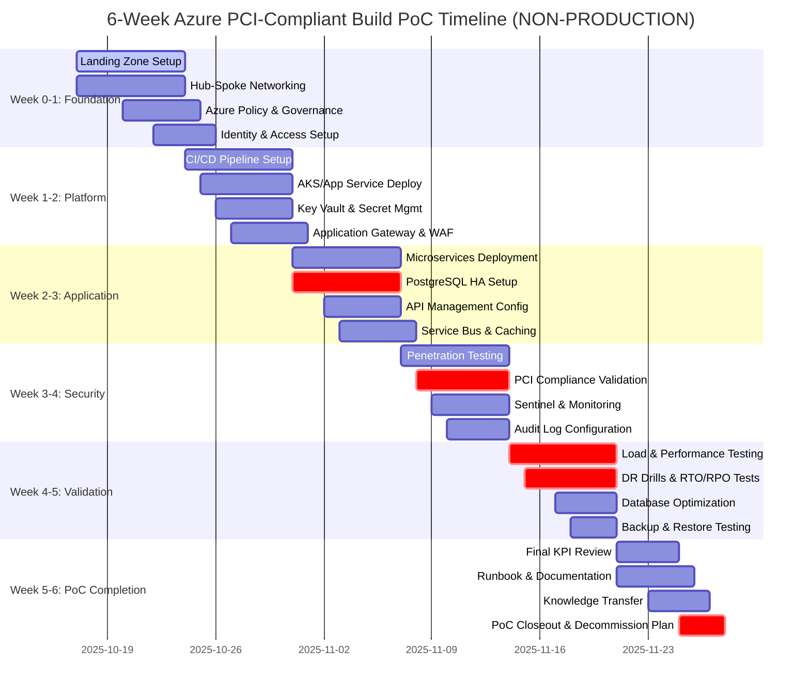
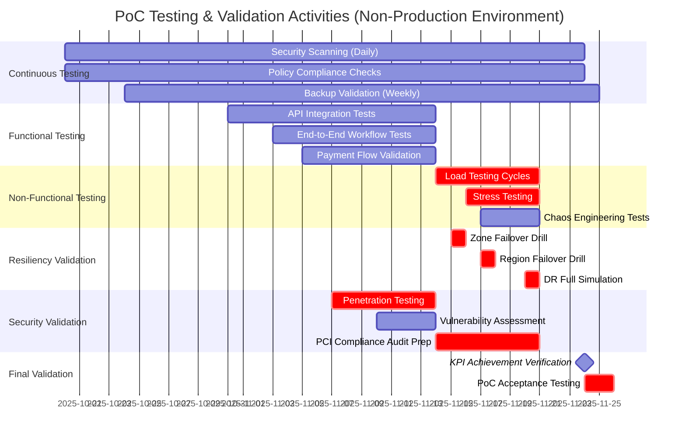

# Azure PCI-Compliant Build Proof of Concept (PoC)

**Version**: 1.0.0  
**Last Updated**: October 17, 2025  
**Document Owner**: Cloud Architecture Team  
**Status**: Active Planning Document

## Table of Contents

- [Executive Summary](#executive-summary)
- [Scope and Context](#scope-and-context)
- [Alignment with Microsoft Cloud Adoption Framework](#alignment-with-microsoft-cloud-adoption-framework)
- [Alignment with Azure Well-Architected Framework](#alignment-with-azure-well-architected-framework)
- [Target Architecture Overview](#target-architecture-overview)
- [PCI DSS Control Mapping](#pci-dss-control-mapping-highlights)
- [Resiliency & Data Protection Strategy](#resiliency--data-protection-strategy)
- [Deployment & Operations Plan](#deployment--operations-plan)
- [Success Criteria & KPIs](#success-criteria--kpis)
- [Testing & Validation Plan](#testing--validation-plan)
- [Governance & Operations](#governance--operations)
- [Risks & Mitigations](#risks--mitigations)
- [Deliverables](#deliverables)
- [Next Steps](#next-steps)
- [References](#references)

## Executive Summary

> **⚠️ PROOF OF CONCEPT ENVIRONMENT - NOT FOR PRODUCTION USE**

This document outlines the plan to deliver a greenfield Azure Build-Out **Proof of Concept (PoC)** for a **PCI DSS–compliant payment gateway** workload. This PoC establishes a **non-production evaluation environment** that demonstrates technical feasibility and validates architecture decisions independently from existing systems. The environment is designed to meet stringent validation objectives:

- **PCI DSS v4.0 alignment** across people, process, and technology controls (demonstration of compliance readiness, not certification)
- **Near-zero data loss** (Recovery Point Objective ≤ 5 seconds) with **downtime under 30 seconds** during failover events (Recovery Time Objective ≤ 30 seconds)
- **Azure-first landing zone** built according to the **Microsoft Cloud Adoption Framework (CAF)** and **Azure Well-Architected Framework (WAF)**
- Clear set of **technical and business KPIs** to prove success and inform the eventual production rollout
- **Time-limited deployment** for validation only, with planned decommissioning after PoC completion

### Key Success Factors

| Factor | Target |
|--------|--------|
| **Timeline** | 6 weeks (Week 0 through Week 6) |
| **Deployment Model** | Greenfield PoC environment (non-production) |
| **Compliance** | PCI DSS v4.0 compliance readiness demonstration |
| **Availability** | 99.95%+ uptime (PoC validation target) |
| **Performance** | ≥1,500 TPS with P99 latency ≤200ms (PoC validation target) |
| **Environment Status** | **NON-PRODUCTION - Evaluation Only** |

> **Note**: For an accelerated 2-3 week delivery option, see [azure-pci-compliant-build-poc-accelerated.md](./azure-pci-compliant-build-poc-accelerated.md)

## Scope and Context

### Project Scope

| Dimension | Details |
|-----------|---------|
| **Environment Type** | **NON-PRODUCTION Proof of Concept** |
| **Deployment Strategy** | Isolated Azure PoC build, no data synchronization with production systems, no cutover |
| **Data Handling** | Greenfield databases with **synthetic/test data only** - NO production data |
| **PoC Completion Model** | Validation and acceptance criteria verification only - **NOT a production go-live** |
| **Production Deployment** | Separate production deployment required after PoC validation and QSA certification |
| **On-Premises Systems** | Remain unchanged; PoC operates as isolated validation environment |
| **Landing Zone** | First Azure workload; landing zone created for PoC validation purposes |
| **Duration** | 6 weeks (includes planning, deployment, testing, knowledge transfer, and decommission planning) |
| **Team Size** | 6-8 FTE (Infrastructure, Security, Platform, Application, Database, QA) |
| **Post-PoC Action** | Environment decommissioned or converted to dev/test after validation |

### Prerequisites

Before starting this PoC, ensure the following prerequisites are met:

- **Azure Subscription**: Active Azure subscription with sufficient quota for enterprise-grade resources
- **Executive Sponsorship**: Confirmed executive sponsor and steering committee
- **Budget Approval**: Approved budget for 6-week PoC and production deployment
- **Team Availability**: Dedicated team members with allocated time for the engagement
- **Access & Permissions**: Global Admin or Owner access to Azure subscription and Microsoft Entra ID tenant
- **Compliance Requirements**: PCI DSS v4.0 documentation and QSA engagement timeline confirmed
- **Network Planning**: IP address ranges allocated for Azure Virtual Networks (hub and spoke)
- **Identity Foundation**: Microsoft Entra ID tenant available for integration

## Alignment with Microsoft Cloud Adoption Framework

The PoC follows the structured approach defined in the [Microsoft Cloud Adoption Framework](https://learn.microsoft.com/azure/cloud-adoption-framework/) to ensure enterprise readiness and sustainable cloud operations.

| CAF Phase | PoC Focus | Key Deliverables |
|-----------|-----------|------------------|
| **Strategy** | Define business outcomes (fraud reduction, payment authorization SLAs, regional expansion) and establish executive sponsorship. | Business case, ROI analysis, executive briefing |
| **Plan** | Build a prioritized backlog covering payment gateway services, compliance controls, networking, observability, and automation. Map skills and staffing requirements for security, networking, and operations teams. | Project plan, skills assessment, resource allocation |
| **Ready** | Stand up an enterprise-scale landing zone including identity, management, security, and networking baselines (Hub-Spoke / Virtual WAN). Integrate Azure Policy for PCI guardrails. | Landing zone blueprint, network topology, governance foundation |
| **Adopt (Innovate)** | Deploy the payment gateway reference architecture using Infrastructure as Code, platform services, and automated CI/CD. | IaC templates, CI/CD pipelines, deployed workload |
| **Govern** | Establish policy-driven governance aligned with PCI DSS requirements and CAF governance disciplines (Cost, Security, Resource Consistency, Identity Baseline, Deployment Acceleration). | Policy framework, compliance reports, cost controls |
| **Manage** | Implement operational baselines: Azure Monitor, Microsoft Sentinel, Defender for Cloud, and ITSM integration for incident/alert handling. | Monitoring dashboards, alert rules, runbooks |

### CAF Resources

- [Cloud Adoption Framework Documentation](https://learn.microsoft.com/azure/cloud-adoption-framework/)
- [Enterprise-Scale Landing Zones](https://learn.microsoft.com/azure/cloud-adoption-framework/ready/enterprise-scale/)
- [Azure Landing Zone Accelerators](https://learn.microsoft.com/azure/architecture/landing-zones/landing-zone-deploy)

## Alignment with Azure Well-Architected Framework

The PoC architecture adheres to the five pillars of the [Azure Well-Architected Framework](https://learn.microsoft.com/azure/well-architected/) to ensure optimal design and operations.

| Pillar | PoC Considerations | Implementation Details |
|--------|-------------------|----------------------|
| **Reliability** | Multi-region active/standby architecture, zone-redundant database tier, geo-redundant backups, automated failover runbooks, synthetic monitoring. | PostgreSQL zone-redundant HA, Azure Site Recovery, health probes, automated failover scripts |
| **Security** | Zero Trust principles, managed identities, Azure Firewall + WAF, Key Vault for secrets, confidential computing when applicable, continuous compliance scanning. | Microsoft Entra ID integration, RBAC, Private Link, encryption at rest and in transit, Defender for Cloud |
| **Cost Optimization** | Right-size compute tiers (reserved capacity evaluation), leverage Azure Savings Plans, cost guardrails via budgets and alerts. | Azure Advisor recommendations, budget alerts, reserved instances evaluation, autoscaling policies |
| **Operational Excellence** | GitOps/CI-CD, Infrastructure as Code (Bicep/Terraform), automated compliance checks, runbook library for failover and break-glass scenarios. | GitHub Actions/Azure DevOps pipelines, Bicep templates, automated testing, comprehensive documentation |
| **Performance Efficiency** | Autoscaling App Service/AKS tiers, caching with Azure Cache for Redis, Application Gateway with WAF autoscaling, load testing to ensure sub-200ms P99 response. | Azure Load Testing, Application Insights, CDN integration, query optimization, connection pooling |

### Well-Architected Framework Resources

- [Azure Well-Architected Framework](https://learn.microsoft.com/azure/well-architected/)
- [Well-Architected Review Tool](https://learn.microsoft.com/assessments/?mode=pre-assessment&id=azure-architecture-review)
- [Financial Services Workload](https://learn.microsoft.com/azure/well-architected/financial/)

## Target Architecture Overview

### High-Level Architecture

The solution leverages a comprehensive set of Azure services to deliver a secure, highly available, and compliant payment gateway platform:

1. **Network Layer**: Hub-Spoke topology with Azure Firewall, DDoS Protection Standard, and Private Link endpoints for all data services.
   - Hub VNet: Shared services (Azure Firewall, Azure Bastion, VPN Gateway)
   - Spoke VNet: Payment workload isolation with NSG-protected subnets
   - Private DNS zones for Azure PaaS services
   - Azure DDoS Protection Standard for enhanced protection

2. **Identity & Access Management**: Microsoft Entra ID (formerly Azure AD) with Conditional Access, Privileged Identity Management, and integration with Microsoft Entra External ID for customer-facing flows.
   - Conditional Access policies for location, device, and risk-based access
   - Privileged Identity Management (PIM) for just-in-time admin access
   - Managed identities for Azure service authentication
   - Microsoft Entra External ID (formerly Azure AD B2C) for customer identity and access management

3. **Application Tier**: Containerized microservices hosted on Azure Kubernetes Service (AKS) or Azure App Service with deployment slots for blue/green releases. Application Gateway (WAF v2) terminates TLS and routes to service mesh.
   - AKS with Azure CNI and Azure AD integration
   - Application Gateway v2 with WAF enabled (OWASP Core Rule Set)
   - API Management for API gateway capabilities
   - Service mesh (optional: Istio/Linkerd) for advanced traffic management

4. **Data Tier**: Azure Database for PostgreSQL Flexible Server (Zone-redundant HA), Azure Cosmos DB for session/state, Azure Storage with immutable blobs for audit logs.
   - PostgreSQL Flexible Server: Zone-redundant HA with synchronous replication
   - Cosmos DB: Multi-region writes for session state (optional)
   - Azure Storage: Immutable storage for compliance and audit logs
   - Azure Cache for Redis: Session and application caching

5. **Integration Layer**: Event-driven processing via Azure Service Bus and Event Grid to support payment events, reconciliation, and fraud analytics.
   - Azure Service Bus Premium: Reliable message queuing for payment processing
   - Event Grid: Event routing and pub/sub messaging
   - Azure Functions: Serverless event processing
   - Logic Apps: Workflow orchestration for complex scenarios

6. **Observability & Monitoring**: Azure Monitor, Application Insights, Log Analytics, and Azure Dashboard/Workbooks for real-time RTO/RPO metrics.
   - Application Insights: APM and distributed tracing
   - Log Analytics: Centralized logging and KQL queries
   - Azure Workbooks: Custom dashboards for KPI tracking
   - Azure Monitor Alerts: Proactive alerting and notification

7. **Security & Compliance**: Azure Policy for PCI guardrails, Microsoft Defender for Cloud, Sentinel analytics, and integration with third-party QSA tooling.
   - Azure Policy: Automated compliance enforcement
   - Microsoft Defender for Cloud: Security posture management and threat protection
   - Microsoft Sentinel: SIEM and SOAR capabilities
   - Azure Key Vault: Centralized secrets and certificate management

### Architecture Diagram

> **Note**: For a detailed architecture diagram with data flows and integration points, refer to the architecture documentation that will be created during the deployment phase.

### Key Azure Services Summary

| Category | Azure Services |
|----------|----------------|
| **Compute** | Azure Kubernetes Service (AKS), App Service, Azure Functions |
| **Database** | Azure Database for PostgreSQL Flexible Server, Azure Cosmos DB, Azure Cache for Redis |
| **Networking** | Virtual Network, Azure Firewall, Application Gateway, Private Link, DDoS Protection |
| **Security** | Microsoft Entra ID, Key Vault, Defender for Cloud, Microsoft Sentinel, Azure Policy |
| **Integration** | Service Bus, Event Grid, API Management, Logic Apps |
| **Monitoring** | Azure Monitor, Application Insights, Log Analytics, Azure Workbooks |
| **Storage** | Azure Storage (Blob, Queue), Azure Backup |

## PCI DSS Control Mapping (Highlights)

The following table maps PCI DSS v4.0 requirements to specific Azure implementation strategies. This is a high-level mapping; detailed control documentation will be maintained in the compliance evidence repository.

| PCI Domain | PCI Requirement Examples | Azure Implementation | Validation Method |
|------------|-------------------------|----------------------|-------------------|
| **Network Security** | Req 1: Install and maintain network security controls | Azure Firewall, NSGs, Application Gateway WAF, Private Link, DDoS Protection Standard | Azure Policy compliance, NSG flow logs, WAF logs |
| **Data Protection** | Req 3: Protect stored account data; Req 4: Protect cardholder data with strong cryptography | Always Encrypted, TDE for databases, Key Vault HSM-backed keys, confidential VM/AKS nodes, immutable storage for logs | Encryption configuration audits, Key Vault access logs, compliance reports |
| **Access Control** | Req 7: Restrict access to system components; Req 8: Identify users and authenticate access | Microsoft Entra ID Conditional Access, MFA, Privileged Identity Management, Just-in-Time VM access, managed identities | Microsoft Entra ID sign-in logs, PIM audit reports, JIT access logs |
| **Monitoring & Logging** | Req 10: Log and monitor all access to system components | Azure Policy enforcement, Defender for Cloud alerts, Sentinel correlation, Log Analytics with 365-day retention, continuous export to immutable storage | Log Analytics queries, retention policies, audit reports |
| **Vulnerability Management** | Req 6: Develop and maintain secure systems and software | Microsoft Defender for Cloud TVM, Azure Automation patch orchestration, container image scanning via ACR/Defender | Vulnerability assessment reports, patch compliance, container scan results |
| **Incident Response** | Req 12: Support organizational security with policies and programs | Sentinel playbooks (Logic Apps), runbooks for payment fraud investigations, integration with SIEM/SOAR and ticketing tools | Incident response drills, playbook execution logs, MTTR metrics |

### PCI DSS v4.0 Key Changes

PCI DSS v4.0 introduces several new requirements and best practices:

- **Customized Implementation Approach**: Organizations can define how they meet security objectives
- **Continuous Compliance**: Shift from point-in-time to continuous monitoring and validation
- **Multi-Factor Authentication (MFA)**: Expanded requirements for MFA across all access types
- **Enhanced Password Requirements**: Stronger password policies and secure storage
- **Encryption and Key Management**: Updated cryptographic requirements
- **Regular Security Assessments**: More frequent testing and validation cycles

### Compliance Resources

- [PCI SSC Official Website](https://www.pcisecuritystandards.org/)
- [Azure PCI DSS Blueprint](https://learn.microsoft.com/azure/governance/blueprints/samples/pci-dss-3.2.1/)
- [Microsoft Trust Center - PCI DSS](https://www.microsoft.com/en-us/trust-center/compliance/pci-dss)

## Resiliency & Data Protection Strategy

### High Availability Design

The architecture is designed to meet aggressive RTO and RPO targets through multiple layers of redundancy:

- **Database HA**: PostgreSQL Flexible Server with zone-redundant HA, synchronous replication, and geo-redundant backups (RA-GRS) to achieve **RPO ≤ 5s**
  - Synchronous replication between availability zones (RPO = 0 for zone failures)
  - Automatic failover with RTO target of 60-120 seconds
  - Hot standby replica ready for immediate promotion
  - Continuous health monitoring and automatic failure detection

- **Application HA**: Multi-region deployment with Traffic Manager or Front Door for failover routing, health probes every 5 seconds
  - Active-passive configuration with automatic failover
  - Health endpoint monitoring with configurable thresholds
  - Deployment slots for zero-downtime deployments
  - Session affinity and state management via Redis or Cosmos DB

- **Network Redundancy**: Zone-redundant Application Gateway and Azure Firewall
  - Multiple gateway instances across availability zones
  - Automatic rerouting during zone failures
  - DDoS Protection Standard for attack mitigation

### Backup & Recovery Strategy

Comprehensive backup strategy to ensure data durability and compliance:

- **Database Backups**:
  - Automated daily full backups with 7-day retention (configurable up to 35 days)
  - Transaction log backups every 5 minutes
  - Geo-redundant backup storage (RA-GRS) for disaster recovery
  - Point-in-time restore capability within retention period
  
- **Backup Validation**:
  - Monthly restore validation tests to staging environment
  - Documented restore procedures and runbooks
  - Backup success rate monitoring (target: 100%)
  
- **Audit Log Retention**:
  - Immutable blob storage for audit logs with 7-year retention
  - WORM (Write Once, Read Many) policy enforcement
  - Continuous export from Log Analytics to storage account

### Disaster Recovery (DR)

Structured DR strategy with tested procedures:

- **Failover Orchestration**: Automated failover orchestration via Azure Automation runbooks, targeted **RTO ≤ 30s** for primary database and application endpoints
  - Pre-validated runbooks for database failover
  - Automated DNS updates and traffic routing
  - Application configuration updates via Key Vault references
  
- **DR Drills**: Quarterly full DR drills to validate procedures and measure actual RTO/RPO
  - Scheduled failover tests in maintenance windows
  - Documented results and lessons learned
  - Continuous improvement of automation scripts
  
- **Recovery Scenarios**:
  - Zone failure: Automatic failover to standby zone (RTO ≤ 2 minutes)
  - Region failure: Manual failover to secondary region (RTO ≤ 30 minutes)
  - Data corruption: Point-in-time restore from backups (RTO ≤ 4 hours)

### Monitoring & Alerting for Resiliency

Real-time monitoring to ensure SLA compliance:

- PostgreSQL replication lag monitoring (alert threshold: >3 seconds)
- Application health endpoint synthetic monitoring (1-minute intervals)
- Backup job success/failure notifications
- Failover event logging and notification
- Azure Service Health alerts for platform issues

### Related Documentation

- [Azure PostgreSQL Flexible Server HA](https://learn.microsoft.com/azure/postgresql/flexible-server/concepts-high-availability)
- [Azure Site Recovery](https://learn.microsoft.com/azure/site-recovery/)
- [Azure Backup Architecture](https://learn.microsoft.com/azure/backup/backup-architecture)

## Deployment & Operations Plan

### ⚠️ PROOF OF CONCEPT DISCLAIMER

> **IMPORTANT**: This is a Proof of Concept (PoC) environment designed for **evaluation and validation purposes only**. This deployment is **NOT intended for production use** or live transaction processing. Key considerations:
>
> - **No Production Data**: Do not import or process live payment data or production cardholder information
> - **Isolated Environment**: This PoC operates independently and should remain isolated from production systems
> - **Time-Limited**: PoC environment should be decommissioned after validation is complete
> - **Security Posture**: While PCI DSS controls are implemented for validation, full production hardening and certification require additional steps
> - **Compliance Status**: This PoC demonstrates compliance readiness but does not constitute PCI DSS certification
> - **Next Steps**: Successful PoC validation should lead to a separate production deployment with full QSA assessment
>
> For production deployment planning, engage with your QSA and review production hardening requirements beyond this PoC scope.

### 6-Week Implementation Timeline

The deployment follows a phased approach with clear milestones and deliverables. Each phase includes validation gates before proceeding to the next.



### Key Milestones & Decision Gates

The following timeline visualizes critical milestones and decision gates throughout the PoC. Each gate requires explicit approval before proceeding to the next phase.

```mermaid
gantt
    title PoC Critical Milestones & Go/No-Go Decision Gates
    dateFormat YYYY-MM-DD
    axisFormat %b %d
    
    section Foundation Gates
    Gate 1: Landing Zone Ready :milestone, gate1, 2025-10-24, 0d
    Gate 2: Network & Security Baseline :milestone, gate2, 2025-10-31, 0d
    
    section Application Gates
    Gate 3: Platform Services Operational :milestone, gate3, 2025-11-07, 0d
    Gate 4: Application Deployed & Functional :milestone, gate4, 2025-11-14, 0d
    
    section Validation Gates
    Gate 5: Security & Compliance Validated :milestone, gate5, 2025-11-18, 0d
    Gate 6: Performance & Resiliency Proven :milestone, gate6, 2025-11-21, 0d
    
    section Final Decision
    Gate 7: PoC Success Criteria Met :milestone, gate7, 2025-11-25, 0d
    Executive Review & Approval :milestone, gate8, 2025-11-28, 0d
```

### Testing & Validation Timeline

This timeline shows the parallel testing activities and their dependencies, emphasizing continuous validation throughout the PoC lifecycle.



#### **Week 0-1 – Landing Zone Foundation**

**Objective**: Establish the Azure foundation with governance, networking, and security baselines.

**Activities**:
- Deploy CAF enterprise-scale landing zone (management groups, identity integration, logging, monitoring)
- Establish hub-spoke networking with DDoS Protection, Azure Firewall/WAF, private DNS, and baseline policies
- Configure governance guardrails (Azure Policy assignments, Defender plan enablement, tagging standards)
- Set up centralized Log Analytics workspace and diagnostics settings
- Configure Microsoft Entra ID integration with Conditional Access policies

**Key Deliverables**:
- Landing zone architecture diagram
- Network topology documentation
- Azure Policy initiative assignments
- RBAC model and assignments
- Monitoring baseline configuration

**Success Criteria**:
- All Azure Policy initiatives deployed and reporting compliant
- Hub-spoke VNets deployed with connectivity validated
- Azure Firewall rules configured and tested
- Log Analytics receiving data from all management resources

**Sample Commands**:
```bash
# Deploy enterprise-scale landing zone using Azure CLI
az deployment mg create \
  --name "eslz-deployment" \
  --location "eastus" \
  --management-group-id "myorg" \
  --template-file "eslz-main.bicep"

# Validate Azure Policy compliance
az policy state list \
  --resource "/subscriptions/{subscription-id}" \
  --filter "complianceState eq 'NonCompliant'"
```

---

#### **Week 1-2 – Platform Enablement**

**Objective**: Deploy CI/CD infrastructure, container platforms, and secret management.

**Activities**:
- Stand up CI/CD pipelines (GitHub Actions/Azure DevOps) with IaC (Bicep/Terraform) and security gates
- Provision AKS/App Service environments with deployment slots, managed identities, and ACR integration
- Implement Key Vault/Managed HSM, certificate lifecycle, and secret rotation automation
- Deploy Application Gateway with WAF v2 and configure routing rules
- Set up Azure Monitor and Application Insights instrumentation

**Key Deliverables**:
- CI/CD pipeline templates and documentation
- AKS cluster or App Service environment
- Azure Container Registry with container scanning enabled
- Key Vault with RBAC and access policies configured
- Application Gateway with SSL termination

**Success Criteria**:
- CI/CD pipeline successfully deploys infrastructure changes
- Container images successfully pushed to ACR
- Application can retrieve secrets from Key Vault using managed identity
- Application Gateway health probes returning 200 OK

**Sample Commands**:
```bash
# Create AKS cluster with Microsoft Entra ID integration
az aks create \
  --resource-group "rg-payment-gateway" \
  --name "aks-payment-prod" \
  --enable-managed-identity \
  --enable-azure-rbac \
  --network-plugin azure \
  --zones 1 2 3

# Configure Key Vault for secret rotation
az keyvault update \
  --name "kv-payment-prod" \
  --enable-rbac-authorization true \
  --enable-purge-protection true
```

---

#### **Week 2-3 – Application & Data Build**

**Objective**: Deploy payment microservices and provision highly available data tier.

**Activities**:
- Deploy payment microservices, API Management, Azure Service Bus, and caching layers into lower environments
- Provision PostgreSQL Flexible Server with zone-redundant HA; enable encryption, auditing, and masking policies
- Integrate logging, telemetry, and SIEM connectors; baseline alert rules for critical events
- Deploy Azure Cache for Redis for session management
- Configure API Management policies for rate limiting and authentication

**Key Deliverables**:
- Payment microservices deployed to dev/staging
- PostgreSQL Flexible Server with zone-redundant HA
- API Management instance with API definitions
- Service Bus namespace with topics and subscriptions
- Application Insights instrumentation

**Success Criteria**:
- All microservices responding to health checks
- PostgreSQL replication lag <1 second
- API calls successfully routed through API Management
- Distributed tracing visible in Application Insights
- Service Bus message processing functional

**Sample Commands**:
```bash
# Create PostgreSQL Flexible Server with zone-redundant HA
az postgres flexible-server create \
  --resource-group "rg-payment-gateway" \
  --name "psql-payment-prod" \
  --location "eastus" \
  --sku-name "Standard_D4ds_v5" \
  --high-availability ZoneRedundant \
  --storage-size 128 \
  --version 16

# Enable Advanced Threat Protection
az postgres flexible-server parameter set \
  --resource-group "rg-payment-gateway" \
  --server-name "psql-payment-prod" \
  --name "azure.enable_defender" \
  --value "on"
```

---

#### **Week 3-4 – Security & Compliance Hardening**

**Objective**: Validate security posture and prepare for PCI DSS assessment.

**Activities**:
- Execute penetration testing, code scanning, and PCI readiness checks; remediate high findings
- Validate policy compliance, secure score improvements, and finalize evidence catalog for QSA review
- Complete threat modeling, runbook creation, and break-glass access reviews
- Implement Microsoft Sentinel analytics rules and playbooks
- Configure immutable storage for audit logs

**Key Deliverables**:
- Penetration test report with remediation evidence
- PCI DSS control evidence repository
- Microsoft Sentinel rules and playbooks
- Threat model documentation
- Break-glass access procedures

**Success Criteria**:
- Defender for Cloud Secure Score ≥85%
- All high-severity vulnerabilities remediated
- PCI DSS evidence 90%+ complete
- Incident response playbooks tested
- Audit log retention policies enforced

**Sample Commands**:
```bash
# Check Defender for Cloud Secure Score
az security secure-score list

# Enable Microsoft Sentinel
az sentinel workspace create \
  --resource-group "rg-security" \
  --workspace-name "la-sentinel-prod"
```

---

#### **Week 4-5 – Resiliency & Performance Validation**

**Objective**: Validate RTO/RPO targets and performance benchmarks.

**Activities**:
- Conduct load testing to confirm TPS, latency targets, and autoscaling behavior
- Execute HA/DR drills (zonal and regional) to prove RTO ≤ 30s and RPO ≤ 5s; refine automation
- Review backup/restore, data retention, and monitoring dashboards with operations team
- Optimize database queries and indexes based on load test results
- Validate autoscaling policies under peak load

**Key Deliverables**:
- Load testing report with performance metrics
- DR drill results with RTO/RPO measurements
- Optimized database schema and indexes
- Validated autoscaling configurations
- Performance baseline documentation

**Success Criteria**:
- TPS ≥1,500 with <1% error rate achieved
- P99 latency ≤200ms under load
- RTO ≤30s validated in failover drill
- RPO ≤5s confirmed via replication lag monitoring
- Backup restore completed successfully

**Sample Commands**:
```bash
# Trigger manual failover for DR drill
az postgres flexible-server failover \
  --resource-group "rg-payment-gateway" \
  --name "psql-payment-prod"

# Run Azure Load Testing
az load test create \
  --resource-group "rg-payment-gateway" \
  --name "load-test-payment-api" \
  --test-plan "test-plan.jmx" \
  --engine-instances 5
```

---

#### **Week 5-6 – PoC Completion & Knowledge Transfer**

**Objective**: Final validation, documentation, operational handoff, and PoC decommission planning.

**Activities**:
- Final executive review against technical and business KPIs; document residual risks
- Deliver operational runbooks, training materials, and governance compliance documentation
- Document PoC findings and recommendations for production deployment
- Conduct knowledge transfer sessions with operations team
- Create operational dashboards and alert response procedures
- Plan PoC environment decommissioning or transition to dev/test

**Key Deliverables**:
- PoC closeout report with recommendations for production deployment
- Complete runbook library
- Operational training materials
- PoC validation report and lessons learned
- Production deployment roadmap (separate from PoC)
- Decommission plan for PoC environment

**Success Criteria**:
- All PoC KPIs met or exceeded
- Operations team trained on architecture and patterns
- Executive sign-off on PoC validation obtained
- Production deployment recommendations documented
- Clear separation between PoC validation and production deployment established

---

### Deployment Tools & Automation

**Infrastructure as Code (IaC)**:
- Primary: Azure Bicep for Azure-native resources
- Alternative: Terraform for multi-cloud scenarios
- Version control: Git with feature branch workflow
- Validation: Automated testing with Pester/InSpec

**CI/CD Pipeline**:
- GitHub Actions or Azure DevOps Pipelines
- Automated security scanning (SAST/DAST)
- Policy compliance checks in pipeline
- Automated testing and validation
- Blue/green or canary deployments

**Configuration Management**:
- Azure App Configuration for application settings
- Key Vault for secrets and certificates
- Azure Policy for compliance enforcement
- Azure Automation for runbooks

## Success Criteria & KPIs

### Technical KPIs

| KPI | Target | Measurement Method |
|-----|--------|--------------------|
| **Recovery Point Objective (RPO)** | ≤ 5 seconds | Database failover drill; monitor replication lag via Azure Monitor metrics. |
| **Recovery Time Objective (RTO)** | ≤ 30 seconds | Simulated region/zonal failover; measure API availability gap via synthetic probes. |
| **Payment API Availability** | ≥ 99.95% during PoC | Azure Monitor availability tests (every 1 minute) across two regions. |
| **Transaction Response Time (P99)** | ≤ 200 ms for authorization requests | Application Insights transaction metrics under peak load. |
| **TPS Sustainment** | ≥ 1,500 TPS with ≤ 1% errors | Load testing using Azure Load Testing/K6 with telemetry in Application Insights. |
| **Security Posture (Secure Score)** | ≥ 85% within landing zone scope | Microsoft Defender for Cloud secure score dashboard. |
| **Policy Compliance** | 100% adherence to PCI guardrail policies | Azure Policy compliance report; no high-severity non-compliant resources. |
| **Backup Success Rate** | 100% daily backups validated monthly | Azure Backup compliance report; restore validation logs. |
| **Secrets Rotation** | Automated rotation ≤ 30 days | Azure Key Vault rotation logs and policy compliance. |
| **Change Lead Time** | ≤ 24 hours from PR merge to production deployment | CI/CD pipeline telemetry (GitHub Actions/Azure DevOps). |

### Business KPIs

| KPI | Target | Measurement Method |
|-----|--------|--------------------|
| **Payment Authorization Success Rate** | ≥ 99% | Business analytics dashboards (Power BI) consuming event data from Service Bus/Event Hub. |
| **Chargeback Reduction** | ≥ 10% vs. on-prem baseline | Compare fraud analytics insights from Azure ML with historical data. |
| **Time to Market for Features** | Reduce by 30% vs. on-prem release cycle | Release cadence metrics from Azure Boards/Azure DevOps. |
| **Compliance Audit Readiness** | PCI DSS interim assessment passed with no critical findings | QSA readiness review; audit evidence repository completion rate. |
| **Operational Efficiency** | Reduce manual intervention by 40% | Track automated incident resolutions vs. manual tickets in ITSM. |
| **Stakeholder Satisfaction** | ≥ 8/10 from key business units | Quarterly stakeholder surveys post-PoC demo. |
| **Cost Predictability** | ±10% variance between forecast vs. actual spend | Azure Cost Management budgets and monthly variance reports. |

## Testing & Validation Plan

- **Performance Testing**: Simulate peak transaction loads with Azure Load Testing/K6. Validate TPS, response times, and autoscaling behavior.
- **Security Validation**: Conduct automated vulnerability scans, manual penetration tests, and review Defender for Cloud recommendations.
- **Compliance Audits**: Produce evidence for PCI controls (network diagrams, access reviews, encryption configs, logging retention) within SharePoint/Teams compliance workspace.
- **DR/Resiliency Drills**: Execute monthly failover tests (zone failure, region failover). Measure RTO/RPO and update runbooks.
- **Operational Readiness**: Run game days covering incident triage, runbook execution, and break-glass access.

## Governance & Operations

- **Change Management**: GitOps-driven change control with automated policy checks and approvals (pull request templates, Azure Policy compliance gates).
- **Monitoring & Alerting**: Centralized Azure Monitor alert rules, integration with Microsoft Teams/ServiceNow. Define action groups for payment failures, security events, and performance degradation.
- **Incident Response**: Sentinel playbooks for fraud spikes, WAF anomalies, and PCI breach responses. 24x7 on-call rotation defined prior to go-live.
- **Cost Control**: Budgets, anomaly detection, and reserved instance recommendations reviewed bi-weekly.

## Risks & Mitigations

| Risk | Impact | Mitigation |
|------|--------|------------|
| Delayed PCI compliance evidence | Go-live blocked | Establish compliance backlog early; automate evidence capture in CI/CD. |
| Data residency considerations | Regulatory non-compliance | Deploy in Azure regions meeting residency requirements; leverage sovereign clouds if needed. |
| Underestimated load | Performance degradation | Early load modeling; scale tests in staging with 2× expected volume. |
| Security misconfiguration | Breach risk | Continuous policy enforcement, Defender for Cloud alerts, weekly security reviews. |
| Skill gaps | Operational inefficiency | Training plan tied to CAF skills readiness; pair Azure specialists with on-prem SMEs. |

## Deliverables

1. **Landing Zone Blueprint** aligned with CAF enterprise-scale architecture.
2. **Payment Gateway Reference Architecture** diagrams and IaC templates.
3. **PCI DSS Control Implementation Guide** with evidence cataloging procedure.
4. **Runbooks** for deployment, failover, incident response, and backup/restore.
5. **KPI Dashboard** (Power BI/Azure Monitor Workbook) tracking technical and business metrics.
6. **PoC Closeout Report** summarizing outcomes, lessons learned, and production rollout recommendations.

## Next Steps

### Immediate Actions (Week 0)

1. **Secure Executive Sponsorship**: Confirm executive sponsor, steering committee members, and project governance structure
2. **Budget Approval**: Finalize PoC funding and production deployment budget allocation
3. **Team Assembly**: Identify and allocate dedicated team members across all required disciplines
4. **Access Provisioning**: Ensure all team members have appropriate Azure subscriptions and permission levels
5. **Schedule Kickoff**: Plan kickoff meeting with all stakeholders and technical teams

### Pre-Deployment Preparation

1. **IP Address Planning**: Allocate and document IP address ranges for hub and spoke VNets
2. **Naming Standards**: Define and document Azure resource naming conventions and tagging strategy
3. **Tool Selection**: Confirm IaC tooling (Bicep vs. Terraform), CI/CD platform (GitHub Actions vs. Azure DevOps)
4. **QSA Engagement**: Initiate engagement with Qualified Security Assessor (QSA) for PCI DSS assessment planning
5. **Training Plan**: Schedule Azure training sessions for team members with limited Azure experience

### Project Governance

1. **Establish Steering Committee**: Weekly meetings for executive oversight and decision-making
2. **Define RACI Matrix**: Clear roles and responsibilities across all project activities
3. **Set Up Scrum Ceremonies**: Daily standups, sprint planning, retrospectives
4. **Create Communication Plan**: Define escalation paths, status reporting cadence, and stakeholder updates
5. **Risk Register**: Maintain active risk register with mitigation plans

### Ongoing Activities

1. **Continuous KPI Tracking**: Monitor KPIs from first resource deployment through go-live
2. **Weekly Security Reviews**: Regular Defender for Cloud score reviews and remediation
3. **Bi-Weekly Cost Reviews**: Monitor Azure spend vs. budget and optimize as needed
4. **Compliance Evidence Collection**: Automated collection throughout deployment lifecycle
5. **Documentation Updates**: Keep all documentation current as architecture evolves

---

## References

### Microsoft Documentation

- [Microsoft Cloud Adoption Framework](https://learn.microsoft.com/azure/cloud-adoption-framework/)
- [Azure Well-Architected Framework](https://learn.microsoft.com/azure/well-architected/)
- [Enterprise-Scale Landing Zones](https://learn.microsoft.com/azure/cloud-adoption-framework/ready/enterprise-scale/)
- [Azure Database for PostgreSQL - Zone-Redundant HA](https://learn.microsoft.com/azure/postgresql/flexible-server/concepts-high-availability)
- [Azure Policy for PCI DSS](https://learn.microsoft.com/azure/governance/policy/samples/pci-dss-3-2-1)
- [Microsoft Defender for Cloud](https://learn.microsoft.com/azure/defender-for-cloud/)
- [Microsoft Sentinel](https://learn.microsoft.com/azure/sentinel/)
- [Azure Monitor](https://learn.microsoft.com/azure/azure-monitor/)

### Compliance & Security

- [PCI Security Standards Council](https://www.pcisecuritystandards.org/)
- [PCI DSS v4.0 Requirements](https://docs-prv.pcisecuritystandards.org/PCI%20DSS/Standard/PCI-DSS-v4_0.pdf)
- [Microsoft Trust Center - PCI DSS](https://www.microsoft.com/en-us/trust-center/compliance/pci-dss)
- [Azure Compliance Documentation](https://learn.microsoft.com/azure/compliance/)

### Related Workshop Documentation

- [Accelerated 2-3 Week PoC Plan](./azure-pci-compliant-build-poc-accelerated.md)
- [Azure PostgreSQL HA Architecture](./architecture.md)
- [Deployment Guide](./deployment-guide.md)
- [Failover Testing Guide](./failover-testing-guide.md)

### Tools & Templates

- [Azure Bicep Documentation](https://learn.microsoft.com/azure/azure-resource-manager/bicep/)
- [Azure Landing Zone Accelerators](https://github.com/Azure/Enterprise-Scale)
- [Azure Quick Start Templates](https://azure.microsoft.com/resources/templates/)
- [GitHub Actions for Azure](https://github.com/Azure/actions)

---

**Document Metadata**

| Property | Value |
|----------|-------|
| **Document Owner** | Cloud Architecture Team |
| **Version** | 1.0.0 |
| **Last Updated** | October 17, 2025 |
| **Status** | Active Planning Document |
| **Review Cycle** | Quarterly |
| **Next Review** | January 2026 |

**Change History**

| Version | Date | Author | Changes |
|---------|------|--------|---------|
| 1.0.0 | October 17, 2025 | Cloud Architecture Team | Initial comprehensive version with enhanced structure, TOC, prerequisites, detailed deployment plan, and references |
