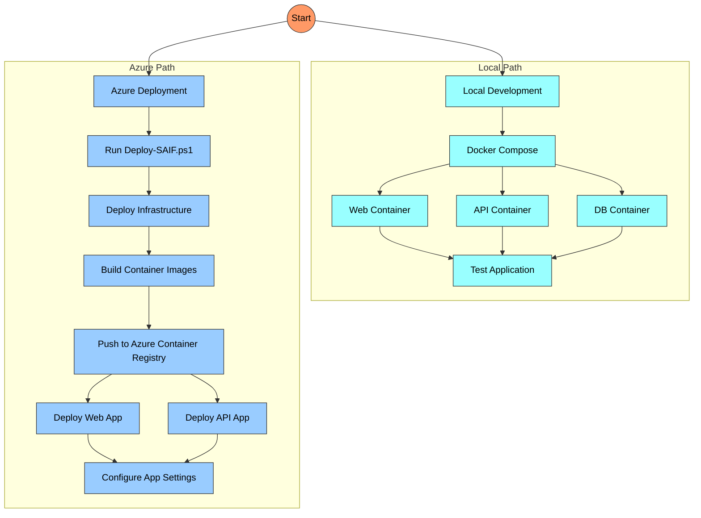
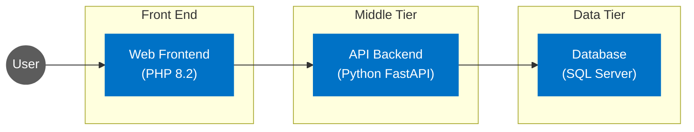
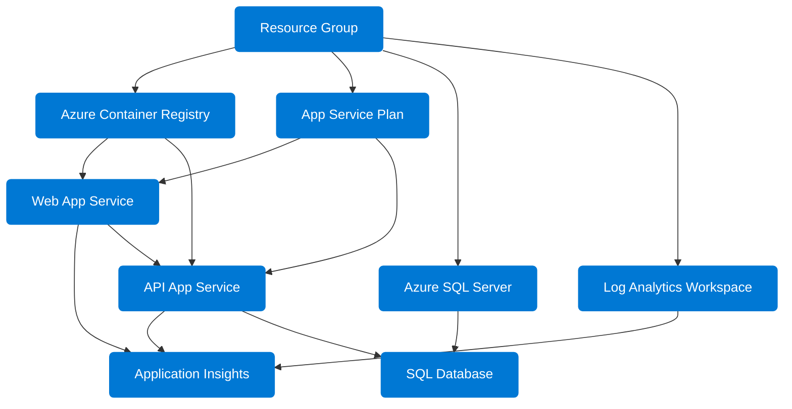

# SAIF: Deployment Guide

## Overview

This document provides detailed instructions for deploying the SAIF (Secure AI Foundations) application to Azure. SAIF is a 3-tier application designed for hands-on learning about securing AI systems across identity, network, application, and content safety domains.

## Deployment Options

SAIF can be deployed in two ways:



1. **Local Development**: Using Docker for local testing
2. **Azure Deployment**: Using Azure App Services and Azure Container Registry

## Prerequisites

- Azure Subscription
- Azure CLI (latest version)
- PowerShell 7.0+
- Docker and Docker Compose (for local development)
- Git

## Local Development Setup

To run SAIF locally for development or testing:

1. Clone the repository:
   ```
   git clone <repository-url>
   cd SAIF
   ```

2. Run the local testing script:
   ```powershell
   cd scripts
   .\Test-SAIFLocal.ps1
   ```

3. Access the application:
   - Web Front End: http://localhost
   - API: http://localhost:8000

4. To stop the application:
   ```powershell
   cd ..
   docker-compose down
   ```

## Azure Deployment

### Default Deployment

To deploy SAIF to Azure with default settings:

1. Clone the repository:
   ```
   git clone <repository-url>
   cd SAIF
   ```

2. Run the deployment script:
   ```powershell
   cd scripts
   .\Deploy-SAIF.ps1
   ```

This will deploy to Sweden Central using the resource group name `rg-aiseclab-swc01`.

### Custom Deployment

To customize your deployment:

```powershell
cd scripts
.\Deploy-SAIF.ps1 -resourceGroupName "my-custom-rg" -location "germanywestcentral" -environmentName "saif-prod"
```

### Deployment Parameters

- `resourceGroupName`: (Optional) Azure resource group name. If not specified, it defaults to `rg-aiseclab-swc01` for Sweden Central or `rg-aiseclab-gwc01` for Germany West Central.
- `location`: (Optional) Azure region for deployment. Default is 'swedencentral'. Allowed values: 'swedencentral', 'germanywestcentral'.
- `environmentName`: (Optional) Environment name used for resource naming. Default is 'saif'.

## Architecture

SAIF is a 3-tier application with the following components:



- **Web Frontend**: PHP 8.2 container running on Azure App Service (B1)
- **API Backend**: Python FastAPI container running on Azure App Service (B1)
- **Database**: Azure SQL Database (Basic tier)

## Azure Resources

The deployment creates the following Azure resources:



- **Resource Group**: Contains all deployment resources
- **Azure Container Registry (Basic tier)**: Stores container images
- **App Service Plan (B1)**: Hosts the App Services
- **Web App Service**: Runs the PHP web frontend
- **API App Service**: Runs the Python FastAPI backend
- **SQL Server and Database**: Stores application data
- **Log Analytics Workspace**: Central log collection
- **Application Insights**: Application monitoring and diagnostics

## Resource Naming Convention

All resources are named using the following pattern:
`{environmentName}-{resourceType}-{randomSuffix}`

Where:
- `environmentName` is the name provided during deployment (default: 'saif')
- `resourceType` describes the resource (e.g., 'api', 'web', 'sql')
- `randomSuffix` is a unique 6-character string based on the resource group ID

## Security Challenges

This application is deliberately insecure for educational purposes. Students are expected to identify and fix security vulnerabilities including:

- Insecure API key handling
- Lack of proper authentication and authorization
- Overly permissive CORS settings
- SQL injection vulnerabilities
- Information disclosure
- And more...

## Troubleshooting

### Docker Issues
- Ensure Docker Desktop is running
- Check container logs: `docker-compose logs`
- Restart containers: `docker-compose restart`

### Azure Deployment Issues
- Check Azure CLI is installed and updated
- Ensure you have the proper permissions in your Azure subscription
- Verify resource quotas and limits for your subscription

## Clean Up Resources

To remove all Azure resources:

```powershell
az group delete --name <resource-group-name> --yes --no-wait
```

## Version Information

- Current Version: 1.0.0
- Last Updated: 2025-06-18
