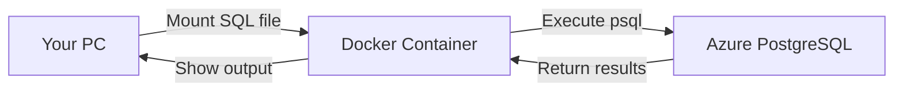

# 🐳 Container-Based Database Initialization Guide

## Overview

This guide provides **container-based solutions** for initializing your SAIF PostgreSQL database without installing PostgreSQL client tools locally. Perfect for modern DevOps workflows and clean development environments!

## 📊 Solution Comparison

| Method | Prerequisites | Setup Time | Best For | Difficulty |
|--------|--------------|------------|----------|-----------|
| **Docker Container** | Docker Desktop | ~5 min | Developers with Docker | ⭐⭐ Easy |
| **Azure Cloud Shell** | Web browser only | ~2 min | Everyone! No installs | ⭐ Easiest |
| **Azure Container Instances** | Azure CLI | ~3 min | CI/CD pipelines | ⭐⭐⭐ Advanced |

---

## 🎯 Option 1: Docker Container (Recommended for Developers)

### Prerequisites
- Docker Desktop installed and running
- Azure CLI authenticated

### Advantages
- ✅ No local PostgreSQL installation needed
- ✅ Consistent environment (official postgres:16-alpine image)
- ✅ Fully automated script
- ✅ Works offline (after first image pull)
- ✅ Great for local development

### Quick Start

```powershell
# Run the automated script
cd c:\Repos\SAIF\SAIF-pgsql\scripts
$pwd = ConvertTo-SecureString "SafeP@ssw0rd2025!" -AsPlainText -Force
.\Initialize-Database-Container.ps1 -resourceGroupName "rg-saif-pgsql-swc-01" -password $pwd
```

### How It Works



The script:
1. Verifies Docker is running
2. Auto-discovers your PostgreSQL server
3. Mounts `init-db.sql` into a PostgreSQL container
4. Executes the SQL script against Azure
5. Removes the container automatically

### Manual Docker Commands (Alternative)

If you prefer manual control:

```powershell
# 1. Get server details
$serverFqdn = az postgres flexible-server show `
    --name psql-saifpg-10081025 `
    --resource-group rg-saif-pgsql-swc-01 `
    --query "fullyQualifiedDomainName" -o tsv

# 2. Run initialization
docker run --rm `
    -e PGPASSWORD="SafeP@ssw0rd2025!" `
    -v "c:/Repos/SAIF/SAIF-pgsql/init-db.sql:/scripts/init-db.sql:ro" `
    postgres:16-alpine `
    psql -h $serverFqdn -U saifadmin -d saifdb -f /scripts/init-db.sql
```

### Troubleshooting Docker

**Docker daemon not running:**
```powershell
# Start Docker Desktop from Windows Start Menu
# Or check Docker Desktop settings
```

**Volume mount issues on Windows:**
```powershell
# Docker Desktop → Settings → Resources → File Sharing
# Ensure C:\ drive is shared
```

---

## ☁️ Option 2: Azure Cloud Shell (Easiest - No Installation!)

### Prerequisites
- Web browser
- Azure account with access to the subscription

### Advantages
- ✅ **ZERO local installations required**
- ✅ psql pre-installed in Cloud Shell
- ✅ Works from any device (Windows, Mac, Linux, Chromebook)
- ✅ Perfect for quick fixes
- ✅ Integrated with Azure Portal

### Quick Start

```powershell
# Run the automated script (opens browser)
cd c:\Repos\SAIF\SAIF-pgsql\scripts
$pwd = ConvertTo-SecureString "SafeP@ssw0rd2025!" -AsPlainText -Force
.\Initialize-Database-CloudShell.ps1 -resourceGroupName "rg-saif-pgsql-swc-01" -password $pwd
```

### Manual Cloud Shell Steps (Alternative)

1. **Open Cloud Shell:**
   - Go to https://shell.azure.com
   - Or click the Cloud Shell icon in Azure Portal

2. **Upload init-db.sql:**
   - Click the 📁 upload button in Cloud Shell toolbar
   - Select `c:\Repos\SAIF\SAIF-pgsql\init-db.sql`

3. **Run initialization:**
   ```bash
   export PGPASSWORD='SafeP@ssw0rd2025!'
   psql -h psql-saifpg-10081025.postgres.database.azure.com \
        -U saifadmin \
        -d saifdb \
        -f init-db.sql
   unset PGPASSWORD
   ```

### Cloud Shell Benefits

- **Pre-installed tools:** psql, az CLI, git, curl, etc.
- **Persistent storage:** Files saved to `$HOME` persist across sessions
- **Authentication:** Automatically uses your Azure credentials
- **Security:** Runs in Azure network, no local credential storage

---

## 🚀 Option 3: Azure Container Instances (Advanced - CI/CD)

### Prerequisites
- Azure CLI authenticated
- Contributor access to resource group

### Advantages
- ✅ Best for CI/CD pipelines
- ✅ No local dependencies
- ✅ Audit logs in Azure
- ✅ Can schedule recurring tasks
- ✅ Network isolation options

### Manual ACI Deployment

```powershell
# 1. Create Azure Container Instance
az container create `
    --resource-group rg-saif-pgsql-swc-01 `
    --name saif-db-init `
    --image postgres:16-alpine `
    --restart-policy Never `
    --environment-variables `
        PGHOST=psql-saifpg-10081025.postgres.database.azure.com `
        PGUSER=saifadmin `
        PGDATABASE=saifdb `
    --secure-environment-variables `
        PGPASSWORD=SafeP@ssw0rd2025! `
    --command-line "/bin/sh -c 'wget https://raw.githubusercontent.com/.../init-db.sql -O /tmp/init.sql && psql -f /tmp/init.sql'"

# 2. Monitor execution
az container logs --resource-group rg-saif-pgsql-swc-01 --name saif-db-init --follow

# 3. Clean up
az container delete --resource-group rg-saif-pgsql-swc-01 --name saif-db-init --yes
```

### ACI with Azure Files (Best Practice)

```powershell
# 1. Upload init-db.sql to Azure Files
$storageAccount = "saifscripts"
$fileShare = "sql-scripts"

# Create storage account and file share (if not exists)
az storage account create --name $storageAccount --resource-group rg-saif-pgsql-swc-01
az storage share create --name $fileShare --account-name $storageAccount

# Upload script
az storage file upload `
    --account-name $storageAccount `
    --share-name $fileShare `
    --source "c:\Repos\SAIF\SAIF-pgsql\init-db.sql" `
    --path "init-db.sql"

# 2. Run ACI with mounted file share
az container create `
    --resource-group rg-saif-pgsql-swc-01 `
    --name saif-db-init `
    --image postgres:16-alpine `
    --restart-policy Never `
    --azure-file-volume-account-name $storageAccount `
    --azure-file-volume-share-name $fileShare `
    --azure-file-volume-mount-path /scripts `
    --environment-variables `
        PGHOST=psql-saifpg-10081025.postgres.database.azure.com `
        PGUSER=saifadmin `
        PGDATABASE=saifdb `
    --secure-environment-variables `
        PGPASSWORD=SafeP@ssw0rd2025! `
    --command-line "psql -f /scripts/init-db.sql"
```

---

## 📋 Comparison: Container vs Traditional Methods

### Traditional Method (Install psql locally)
```
❌ Need to install PostgreSQL (100+ MB)
❌ PATH configuration
❌ Version compatibility issues
❌ Clutters system with unused tools
✅ Familiar for database admins
```

### Container Method (Docker/ACI)
```
✅ No local installation needed
✅ Consistent environment
✅ Easy cleanup (--rm flag)
✅ Perfect for CI/CD
✅ Version control (use specific image tag)
❌ Requires Docker/Azure access
```

### Cloud Shell Method
```
✅ Zero installation
✅ Works from any device
✅ Always up-to-date
✅ Perfect for one-time tasks
❌ Requires internet connection
```

---

## 🎯 Which Option Should You Choose?

### Choose **Docker Container** if:
- ✓ You have Docker Desktop installed
- ✓ You want repeatable local automation
- ✓ You work offline occasionally
- ✓ You're comfortable with containers

### Choose **Azure Cloud Shell** if:
- ✓ You want the quickest solution
- ✓ You don't want to install anything
- ✓ You're doing a one-time initialization
- ✓ You work from multiple devices

### Choose **Azure Container Instances** if:
- ✓ You're building CI/CD pipelines
- ✓ You need audit trails
- ✓ You want scheduled database tasks
- ✓ You need network isolation

---

## 🔒 Security Best Practices

### For All Methods:

1. **Never hardcode passwords in scripts**
   ```powershell
   # ✅ Good: Use SecureString
   $pwd = ConvertTo-SecureString "password" -AsPlainText -Force
   
   # ❌ Bad: Plain text in script
   $password = "SafeP@ssw0rd2025!"
   ```

2. **Use Azure Key Vault for production**
   ```powershell
   $password = az keyvault secret show `
       --vault-name "saif-keyvault" `
       --name "postgres-admin-password" `
       --query "value" -o tsv
   ```

3. **Rotate credentials regularly**
   ```powershell
   # Update PostgreSQL password
   az postgres flexible-server update `
       --resource-group rg-saif-pgsql-swc-01 `
       --name psql-saifpg-10081025 `
       --admin-password "NewSecurePassword!"
   ```

4. **Use Managed Identity when possible**
   ```powershell
   # Configure Entra ID authentication
   az postgres flexible-server ad-admin create `
       --resource-group rg-saif-pgsql-swc-01 `
       --server-name psql-saifpg-10081025 `
       --display-name "SAIF-App-Identity" `
       --object-id "<managed-identity-object-id>"
   ```

---

## 🔍 Verification Steps

After running initialization with any method:

```powershell
# 1. Verify data via API
$response = Invoke-RestMethod "https://app-saifpg-api-10081025.azurewebsites.net/api/customers/1"
$response | ConvertTo-Json

# Expected output:
# {
#   "id": 1,
#   "email": "john.doe@example.com",
#   "first_name": "John",
#   "last_name": "Doe",
#   ...
# }

# 2. Check transaction count
$response = Invoke-RestMethod "https://app-saifpg-api-10081025.azurewebsites.net/api/healthcheck"
Write-Host "Database status: $($response.database)" -ForegroundColor Green

# 3. Open web app and verify UI
Start-Process "https://app-saifpg-web-10081025.azurewebsites.net"
```

---

## 🛠️ Troubleshooting

### Issue: "Could not connect to server"

**Docker:**
```powershell
# Check firewall rules
az postgres flexible-server firewall-rule list `
    --resource-group rg-saif-pgsql-swc-01 `
    --name psql-saifpg-10081025
```

**Cloud Shell:**
```bash
# Cloud Shell IPs are pre-allowed via 0.0.0.0-0.0.0.0 rule
# Check if AllowAllAzureServices rule exists
az postgres flexible-server firewall-rule show `
    --resource-group rg-saif-pgsql-swc-01 `
    --server-name psql-saifpg-10081025 `
    --rule-name AllowAllAzureServicesAndResourcesWithinAzureIps
```

### Issue: "Authentication failed"

```powershell
# Test password
$env:PGPASSWORD = "SafeP@ssw0rd2025!"
psql -h psql-saifpg-10081025.postgres.database.azure.com -U saifadmin -d postgres -c "\l"
$env:PGPASSWORD = $null
```

### Issue: Docker "no matching manifest"

```powershell
# Update Docker Desktop
# Or specify platform explicitly
docker run --platform linux/amd64 --rm postgres:16-alpine psql --version
```

---

## 📚 Additional Resources

- [Docker PostgreSQL Official Image](https://hub.docker.com/_/postgres)
- [Azure Cloud Shell Documentation](https://learn.microsoft.com/azure/cloud-shell/overview)
- [Azure Container Instances](https://learn.microsoft.com/azure/container-instances/)
- [PostgreSQL psql Documentation](https://www.postgresql.org/docs/current/app-psql.html)

---

## 📞 Need Help?

If you encounter issues:

1. Check the error messages carefully
2. Verify network connectivity: `Test-NetConnection psql-saifpg-10081025.postgres.database.azure.com -Port 5432`
3. Ensure firewall rules allow your connection
4. Verify admin password is correct
5. Check Azure service health status

---

**Generated:** $(Get-Date -Format "yyyy-MM-dd HH:mm:ss")  
**Version:** 1.0.0  
**SAIF Project:** PostgreSQL Deployment
