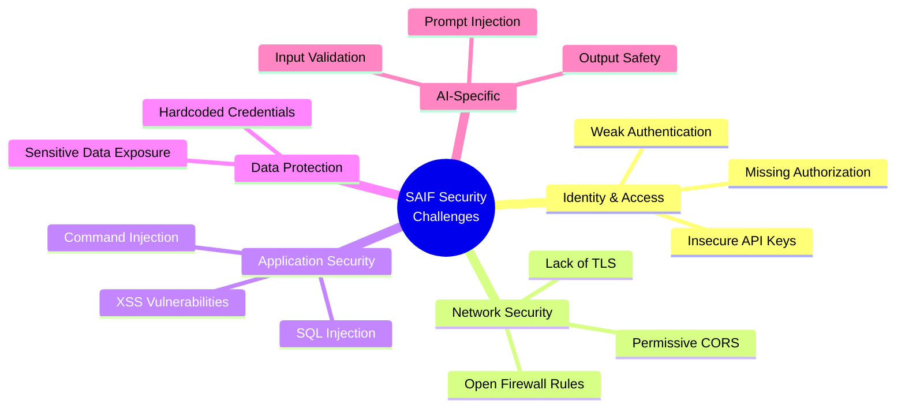
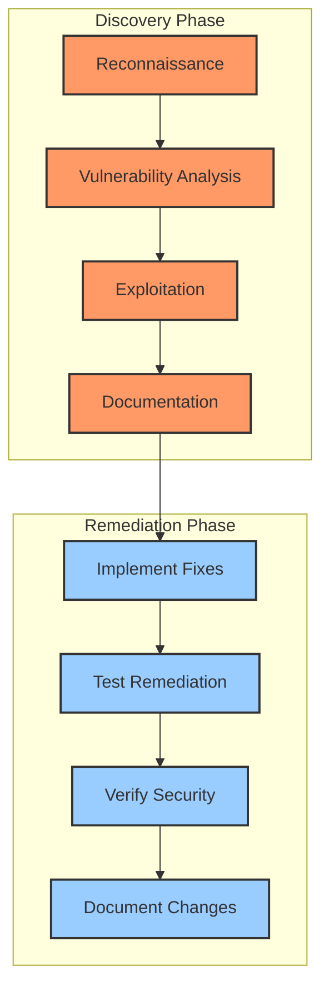

# SAIF: Security Challenges

## Overview

This document outlines the security challenges integrated into the SAIF (Secure AI Foundations) application. These vulnerabilities are deliberately included for educational purposes to help students learn about security concepts in AI applications.

## Security Challenge Categories

### 1. Identity and Access Management

- **Insecure API Key Handling**: 
  - Hardcoded API keys in configuration
  - Keys transmitted in HTTP headers without proper protection
  - No key rotation mechanisms

- **Authentication Weaknesses**:
  - Lack of multi-factor authentication
  - No proper user authentication system
  - Insecure session management

### 2. Network Security

- **Overly Permissive CORS**:
  - CORS configured to allow all origins (`*`)
  - Missing or improperly configured content security policies

- **SQL Server Firewall Rules**:
  - Overly permissive firewall rules (allowing all Azure services)
  - Public network access enabled

### 3. Application Security

- **SQL Injection**:
  - Direct string concatenation in SQL queries
  - Lack of parameterized queries or proper input sanitization

- **Command Injection**:
  - The URL fetching endpoint allows arbitrary URL requests
  - No validation on input parameters

- **Cross-Site Scripting (XSS)**:
  - Unsanitized outputs in the web interface
  - Missing Content-Security-Policy headers

### 4. Data Protection

- **Hardcoded Credentials**:
  - Database credentials in configuration files
  - Insecure storage of authentication information

- **Sensitive Data Exposure**:
  - Environment variable disclosure through API
  - Excessive error information exposed to users

### 5. AI-Specific Vulnerabilities

- **Lack of Input Validation for AI Systems**:
  - No validation on inputs to AI endpoints
  - Missing restrictions on prompt content

- **Prompt Injection Vulnerabilities**:
  - No controls to prevent adversarial prompts
  - Missing defenses against prompt manipulation

- **Output Data Security**:
  - No filtering or sanitization of AI-generated outputs
  - Lack of monitoring for harmful content

## Security Challenge Discovery and Remediation

Students should follow these steps to discover security issues:

1. **Reconnaissance**: Examine API endpoints, app settings, and configurations
2. **Vulnerability Analysis**: Identify security weaknesses in the application
3. **Exploitation**: Test identified vulnerabilities in a controlled manner
4. **Documentation**: Document findings and potential remediations

## Remediation Approaches

For each vulnerability type, students should consider implementing:

1. **Proper Authentication**: Implement OAuth2, JWT tokens, or other standard authentication
2. **Input Validation**: Sanitize and validate all inputs with strict type checking
3. **Parameterized Queries**: Use query parameters for all database operations
4. **Least Privilege**: Apply the principle of least privilege to all components
5. **Network Security**: Configure proper CORS, firewall rules, and VNet integration
6. **Secrets Management**: Use Azure Key Vault or other secure storage for secrets
7. **AI Safety Guards**: Implement content filtering, prompt validation, and output scanning

## Verification

After implementing security fixes, students should verify the effectiveness by:

1. Running security scanning tools
2. Attempting to exploit the previously identified vulnerabilities
3. Verifying that sensitive information is properly protected
4. Ensuring that the application still functions correctly

## Learning Resources

- [OWASP Top Ten](https://owasp.org/www-project-top-ten/)
- [Microsoft Security Best Practices](https://docs.microsoft.com/en-us/azure/security/fundamentals/overview)
- [OWASP AI Security and Privacy Guide](https://owasp.org/www-project-ai-security-and-privacy-guide/)
- [Microsoft AI Security Best Practices](https://learn.microsoft.com/en-us/azure/cognitive-services/openai/concepts/security)
