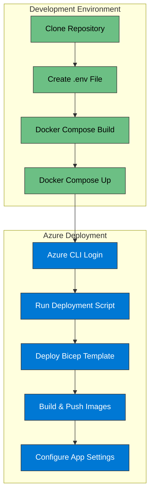

# SAIF Container Deployment

[](https://learn.microsoft.com/en-us/devops/deliver/what-is-infrastructure-as-code)
[](https://azure.microsoft.com/en-us/products/container-apps/)
[](https://docs.docker.com/compose/)
[](https://learn.microsoft.com/en-us/azure/azure-resource-manager/bicep/overview)

This document outlines how to deploy the SAIF application using containers with Docker and Azure Container Apps.



## Local Development with Docker

### Prerequisites
- Docker and Docker Compose installed
- Azure CLI installed (for deployment)

### Setup

1. Clone the repository:
   ```bash
   git clone <repository-url>
   cd SAIF
   ```

2. Create a `.env` file from the example:
   ```bash
   cp api/.env.example .env
   ```

3. Update the environment variables in the `.env` file with your database connection details.

4. Build and run the containers:
   ```bash
   docker-compose up --build
   ```

5. Access the API at http://localhost:8000 and the web frontend at http://localhost:80

## Deploying to Azure

### Using the Deployment Script

1. Ensure you're logged in to Azure CLI:
   ```powershell
   az login
   ```

2. Run the deployment script:
   ```powershell
   ./deploy.ps1 -resourceGroup saif-rg -location eastus
   ```

3. The script will output the URLs and connection information when complete.

### Using Bicep for Infrastructure as Code

1. Deploy the Bicep template:
   ```powershell
   az group create --name saif-rg --location eastus
   az deployment group create --resource-group saif-rg --template-file infra/main.bicep
   ```

2. Build and push the API image to your container registry:
   ```powershell
   $acrName = "your-acr-name"  # Get this from the Bicep output
   
   # Login to ACR
   az acr login --name $acrName
   
   # Build and push the API image
   az acr build --registry $acrName --image saif/api:latest ./api
   ```

## Security Challenges

This application is deliberately insecure to provide learning opportunities. Consider the following security issues that need to be addressed:

1. Public SQL Server firewall rules
2. Hardcoded credentials in configuration
3. Insecure CORS configuration (allows all origins)
4. Lack of proper authentication and authorization
5. Information disclosure in the API endpoints
6. SQL injection vulnerabilities
7. Command injection vulnerabilities

## Next Steps

Add the web frontend and database initialization scripts to complete the application.
