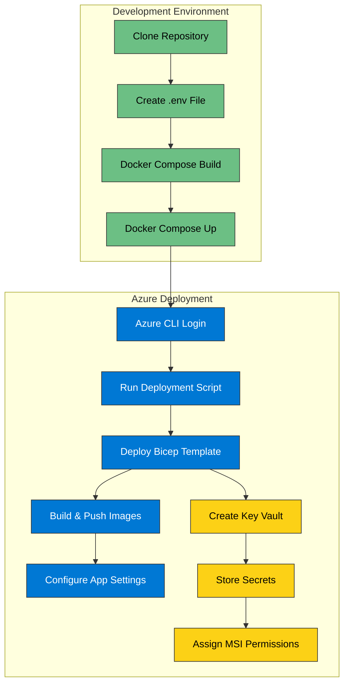

# SAIF Infrastructure as Code

[](https://learn.microsoft.com/en-us/devops/deliver/what-is-infrastructure-as-code)
[](https://azure.microsoft.com/en-us/products/app-service/)
[](https://docs.docker.com/)
[](https://learn.microsoft.com/en-us/azure/azure-resource-manager/bicep/overview)
[](https://learn.microsoft.com/en-us/security/)
[](https://azure.microsoft.com/en-us/products/key-vault/)

This document outlines how to deploy the SAIF application using Bicep Infrastructure as Code and secure container deployments to Azure App Service.



## Local Development with Docker

### Prerequisites
- Docker and Docker Compose installed
- Azure CLI installed (for deployment)

### Setup

1. Clone the repository:
   ```bash
   git clone <repository-url>
   cd SAIF
   ```

2. Create a `.env` file from the example:
   ```bash
   cp api/.env.example .env
   ```

3. Update the environment variables in the `.env` file with your database connection details.

4. Build and run the containers:
   ```bash
   docker-compose up --build
   ```

5. Access the API at http://localhost:8000 and the web frontend at http://localhost:80

## Deploying to Azure

### Using the Enhanced Deployment Script

1. Ensure you're logged in to Azure CLI:
   ```powershell
   az login
   ```

2. Run the deployment script from the scripts folder:
   ```powershell
   cd scripts
   ./Deploy-SAIF.ps1 -location "swedencentral"
   ```

3. The script provides an interactive experience:
   - Select an Azure subscription
   - Confirm or change the deployment region
   - Enter a secure SQL administrator password
   - Review and confirm deployment parameters

4. The script will output the URLs and connection information when complete.

### Manual Deployment with Bicep

1. Deploy the Bicep template:
   ```powershell
   # Create a resource group
   az group create --name rg-saif-swc01 --location swedencentral
   
   # Deploy the Bicep template with secure SQL password
   az deployment group create --resource-group rg-saif-swc01 --template-file infra/main.bicep `
     --parameters environmentName=saif location=swedencentral sqlAdminPassword=YourSecurePassword123!
   ```

2. Build and push the container images to your Azure Container Registry:
   ```powershell
   $acrName = "your-acr-name"  # Get this from the deployment output
   
   # Build and push the API image
   az acr build --registry $acrName --image saif/api:latest --file ../api/Dockerfile ../api
   
   # Build and push the Web image
   az acr build --registry $acrName --image saif/web:latest --file ../web/Dockerfile ../web
   ```

### Bicep Infrastructure Components

The infrastructure deploys:

1. **Azure Container Registry** - Stores container images
2. **App Service Plan** - Hosts the web and API containers
3. **App Services** - Runs the web frontend and API containers
4. **Azure SQL Database** - Stores application data
5. **Log Analytics Workspace** - Centralizes monitoring
6. **Application Insights** - Provides application telemetry
7. **Key Vault** - Securely stores credentials and secrets

## Security Enhancements

The infrastructure includes several security enhancements:

1. **Key Vault Integration** - Secrets storage separated from code
2. **Managed Identities** - App Services use system-assigned identities
3. **RBAC for Key Vault** - Principle of least privilege for secret access
4. **Secure Password Handling** - SQL password securely prompted and validated
5. **Environment-based Configuration** - Using environment variables for configuration
6. **Proper Tagging** - Resources tagged for governance and management

## Remaining Security Challenges

Some security challenges are deliberately left in place for educational purposes:

1. Public SQL Server firewall rules (deliberately insecure)
2. Insecure CORS configuration allowing all origins (deliberately insecure)
3. Information disclosure in the API endpoints (deliberately insecure)
4. Hardcoded API keys in configuration (deliberately insecure)
5. Minimal TLS version set to 1.0 (deliberately insecure)

## Best Practices Implemented

1. **Clear Module Structure** - Each resource type has its own module
2. **Parent/Child Relationships** - Proper resource relationships
3. **Environment Suffixes** - Using `environment().suffixes` for portability
4. **Secure Parameter Handling** - @secure() for sensitive parameters
5. **Consistent Tagging** - All resources tagged consistently
6. **No Secret Outputs** - Removed outputs that expose secrets
7. **Descriptive Metadata** - All modules include descriptive metadata

## Next Steps

1. Enforce TLS 1.2+ for production deployments
2. Implement Azure Private Link for SQL Server
3. Configure Virtual Network integration for App Services
4. Add Web Application Firewall (WAF) protection
5. Implement proper CORS policy with specific origins
6. Rotate secrets and API keys regularly
